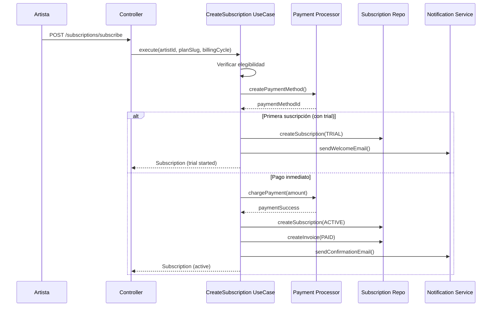
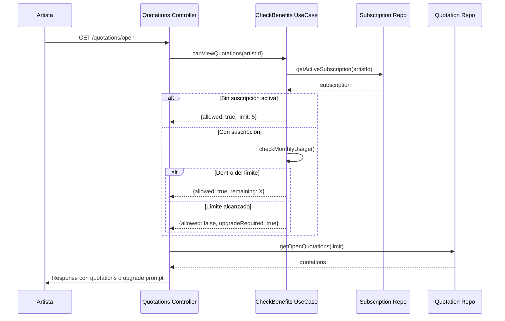
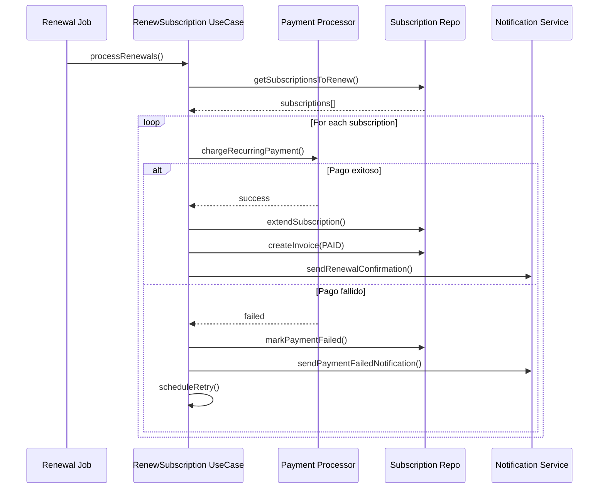

# Plan de Implementación: Sistema de Suscripciones para Artistas

## 📋 Resumen Ejecutivo

Este documento describe el plan completo para implementar un sistema de suscripciones premium para artistas en la plataforma Inker. Los artistas podrán suscribirse a diferentes planes que les otorgarán beneficios como mayor visibilidad, acceso prioritario a cotizaciones abiertas, y herramientas avanzadas para gestionar su negocio.

## 🎯 Objetivos

1. **Monetización de Artistas**: Generar ingresos recurrentes a través de suscripciones mensuales/anuales
2. **Valor Agregado**: Ofrecer herramientas y beneficios que ayuden a los artistas a crecer su negocio
3. **Retención**: Aumentar la retención de artistas activos en la plataforma
4. **Diferenciación**: Permitir que artistas comprometidos se destaquen en la plataforma

## 🏗️ Arquitectura del Sistema

### Módulos a Crear/Modificar

```
src/
├── subscriptions/                    # NUEVO MÓDULO
│   ├── domain/
│   │   ├── dtos/
│   │   │   ├── subscription.dto.ts
│   │   │   ├── subscription-plan.dto.ts
│   │   │   ├── subscription-benefit.dto.ts
│   │   │   └── subscription-invoice.dto.ts
│   │   ├── enums/
│   │   │   ├── plan-type.enum.ts
│   │   │   ├── subscription-status.enum.ts
│   │   │   ├── billing-cycle.enum.ts
│   │   │   └── benefit-type.enum.ts
│   │   ├── interfaces/
│   │   │   ├── subscription-repository.interface.ts
│   │   │   ├── payment-processor.interface.ts
│   │   │   └── benefit-handler.interface.ts
│   │   ├── models/
│   │   │   ├── subscription.model.ts
│   │   │   ├── subscription-plan.model.ts
│   │   │   └── subscription-history.model.ts
│   │   └── errors/
│   │       ├── subscription-expired.error.ts
│   │       └── downgrade-restricted.error.ts
│   ├── infrastructure/
│   │   ├── controllers/
│   │   │   ├── subscriptions.controller.ts
│   │   │   └── subscription-admin.controller.ts
│   │   ├── entities/
│   │   │   ├── subscription.entity.ts
│   │   │   ├── subscription-plan.entity.ts
│   │   │   ├── subscription-history.entity.ts
│   │   │   └── subscription-invoice.entity.ts
│   │   ├── repositories/
│   │   │   ├── subscription.repository.ts
│   │   │   ├── subscription-plan.repository.ts
│   │   │   ├── subscription-history.repository.ts
│   │   │   └── subscriptionRepository.module.ts
│   │   ├── services/
│   │   │   ├── subscription-payment.service.ts
│   │   │   └── benefit-manager.service.ts
│   │   └── jobs/
│   │       ├── subscription-renewal.job.ts
│   │       ├── subscription-expiry.job.ts
│   │       └── trial-reminder.job.ts
│   ├── usecases/
│   │   ├── create-subscription.usecase.ts
│   │   ├── update-subscription.usecase.ts
│   │   ├── cancel-subscription.usecase.ts
│   │   ├── renew-subscription.usecase.ts
│   │   ├── check-subscription-benefits.usecase.ts
│   │   ├── get-subscription-status.usecase.ts
│   │   ├── get-available-plans.usecase.ts
│   │   └── process-subscription-payment.usecase.ts
│   └── subscriptions.module.ts
├── artists/                          # MODIFICAR
│   └── usecases/
│       ├── searchArtists.usecase.ts  # Integrar prioridad por suscripción
│       └── getArtistProfile.usecase.ts # Mostrar badge de suscripción
├── quotations/                       # MODIFICAR  
│   └── usecases/
│       └── getOpenQuotations.usecase.ts # Limitar acceso según plan
└── analytics/                        # MODIFICAR
    └── usecases/
        └── getArtistAnalytics.usecase.ts # Analytics avanzados para premium
```

### Base de Datos

Siguiendo la estrategia multi-DB del proyecto, el sistema de suscripciones usará su propia base de datos: `subscriptions-db`

#### Entidades

**SubscriptionPlan**
```typescript
{
  id: string;                     // UUID
  name: string;                   // "Básico", "Profesional", "Premium"
  slug: string;                   // "basic", "professional", "premium"
  description: string;
  monthlyPrice: number;           // Precio mensual
  annualPrice: number;            // Precio anual (con descuento)
  currency: string;               // USD, MXN, etc.
  features: {
    quotationLimit: number;       // Cotizaciones abiertas que puede ver por mes
    priorityPlacement: boolean;   // Aparece primero en búsquedas
    analyticsAccess: boolean;     // Acceso a analytics avanzados
    verifiedBadge: boolean;       // Badge de verificado
    customUrl: boolean;           // URL personalizada del perfil
    unlimitedPortfolio: boolean;  // Sin límite de trabajos en portfolio
    promotionalTools: boolean;    // Herramientas de promoción
    leadNotifications: boolean;   // Notificaciones instantáneas de leads
    apiAccess: boolean;          // Acceso a API (futuro)
    supportPriority: string;     // "standard", "priority", "vip"
  };
  benefits: string[];            // Lista de beneficios en texto
  limitations: {
    monthlyQuotationViews?: number;
    portfolioItemsLimit?: number;
    monthlyPromotions?: number;
  };
  trialDays: number;             // Días de prueba gratis
  isActive: boolean;
  displayOrder: number;          // Para ordenar en UI
  recommended: boolean;          // Plan recomendado
  createdAt: Date;
  updatedAt: Date;
}
```

**Subscription**
```typescript
{
  id: string;                          // UUID
  artistId: string;                    // ID del artista en artist-db
  userId: string;                      // ID del usuario en user-db
  planId: string;                      // Referencia a SubscriptionPlan
  status: SubscriptionStatus;          // TRIAL, ACTIVE, CANCELLED, EXPIRED, SUSPENDED
  billingCycle: BillingCycle;          // MONTHLY, ANNUAL
  currentPeriodStart: Date;
  currentPeriodEnd: Date;
  trialEndsAt?: Date;
  cancelledAt?: Date;
  cancelReason?: string;
  metadata: {
    source: string;                    // "web", "app", "admin"
    promotionCode?: string;
    referralCode?: string;
    previousPlanId?: string;
    paymentMethod?: string;
    lastPaymentAmount?: number;
    lastPaymentDate?: Date;
    failedPaymentAttempts?: number;
  };
  features: {                          // Snapshot de features del plan
    quotationLimit: number;
    priorityPlacement: boolean;
    // ... mismo que en SubscriptionPlan
  };
  usage: {
    quotationViewsThisMonth: number;
    lastQuotationViewDate?: Date;
    promotionsUsedThisMonth: number;
  };
  autoRenew: boolean;
  nextBillingDate?: Date;
  gracePeriodEndsAt?: Date;           // Período de gracia después de fallo de pago
  createdAt: Date;
  updatedAt: Date;
}
```

**SubscriptionHistory**
```typescript
{
  id: string;                          // UUID
  subscriptionId: string;
  artistId: string;
  userId: string;
  action: SubscriptionAction;          // CREATED, UPGRADED, DOWNGRADED, RENEWED, CANCELLED, EXPIRED, SUSPENDED, REACTIVATED
  fromPlanId?: string;
  toPlanId?: string;
  fromStatus?: SubscriptionStatus;
  toStatus?: SubscriptionStatus;
  amount?: number;
  currency?: string;
  metadata: {
    reason?: string;
    initiatedBy?: string;              // "user", "system", "admin"
    adminUserId?: string;
    paymentReference?: string;
    promotionApplied?: string;
    discountAmount?: number;
    notes?: string;
  };
  ipAddress?: string;
  userAgent?: string;
  createdAt: Date;
}
```

**SubscriptionInvoice**
```typescript
{
  id: string;                          // UUID
  subscriptionId: string;
  artistId: string;
  userId: string;
  invoiceNumber: string;               // Formato: INV-2024-000001
  status: InvoiceStatus;               // DRAFT, PENDING, PAID, FAILED, REFUNDED, CANCELLED
  billingPeriodStart: Date;
  billingPeriodEnd: Date;
  items: Array<{
    description: string;
    quantity: number;
    unitPrice: number;
    totalPrice: number;
  }>;
  subtotal: number;
  tax: number;
  taxRate: number;
  discount: number;
  discountReason?: string;
  total: number;
  currency: string;
  paymentMethod?: string;
  paymentReference?: string;
  paidAt?: Date;
  dueDate: Date;
  attemptCount: number;                // Intentos de cobro
  lastAttemptAt?: Date;
  nextAttemptAt?: Date;
  customerInfo: {                      // Snapshot para facturación
    name: string;
    email: string;
    taxId?: string;
    address?: string;
  };
  notes?: string;
  metadata: Record<string, any>;
  createdAt: Date;
  updatedAt: Date;
}
```

#### Scripts SQL de Migración

```sql
-- Crear base de datos
CREATE DATABASE inker_subscriptions;

-- Conectar a la base de datos
\c inker_subscriptions;

-- Crear extensión UUID
CREATE EXTENSION IF NOT EXISTS "uuid-ossp";

-- Tabla subscription_plans
CREATE TABLE subscription_plans (
    id UUID PRIMARY KEY DEFAULT uuid_generate_v4(),
    name VARCHAR(100) NOT NULL,
    slug VARCHAR(50) NOT NULL UNIQUE,
    description TEXT,
    monthly_price DECIMAL(10,2) NOT NULL,
    annual_price DECIMAL(10,2) NOT NULL,
    currency VARCHAR(3) NOT NULL DEFAULT 'USD',
    features JSONB NOT NULL DEFAULT '{}',
    benefits TEXT[] DEFAULT '{}',
    limitations JSONB DEFAULT '{}',
    trial_days INTEGER DEFAULT 0,
    is_active BOOLEAN DEFAULT true,
    display_order INTEGER DEFAULT 0,
    recommended BOOLEAN DEFAULT false,
    created_at TIMESTAMP NOT NULL DEFAULT CURRENT_TIMESTAMP,
    updated_at TIMESTAMP NOT NULL DEFAULT CURRENT_TIMESTAMP,
    INDEX idx_slug (slug),
    INDEX idx_is_active (is_active),
    INDEX idx_display_order (display_order)
);

-- Tabla subscriptions
CREATE TABLE subscriptions (
    id UUID PRIMARY KEY DEFAULT uuid_generate_v4(),
    artist_id VARCHAR(255) NOT NULL,
    user_id VARCHAR(255) NOT NULL,
    plan_id UUID NOT NULL REFERENCES subscription_plans(id),
    status VARCHAR(50) NOT NULL CHECK (status IN ('TRIAL', 'ACTIVE', 'CANCELLED', 'EXPIRED', 'SUSPENDED')),
    billing_cycle VARCHAR(20) NOT NULL CHECK (billing_cycle IN ('MONTHLY', 'ANNUAL')),
    current_period_start TIMESTAMP NOT NULL,
    current_period_end TIMESTAMP NOT NULL,
    trial_ends_at TIMESTAMP,
    cancelled_at TIMESTAMP,
    cancel_reason TEXT,
    metadata JSONB DEFAULT '{}',
    features JSONB NOT NULL DEFAULT '{}',
    usage JSONB DEFAULT '{}',
    auto_renew BOOLEAN DEFAULT true,
    next_billing_date TIMESTAMP,
    grace_period_ends_at TIMESTAMP,
    created_at TIMESTAMP NOT NULL DEFAULT CURRENT_TIMESTAMP,
    updated_at TIMESTAMP NOT NULL DEFAULT CURRENT_TIMESTAMP,
    UNIQUE(artist_id),
    INDEX idx_user_id (user_id),
    INDEX idx_status (status),
    INDEX idx_plan_id (plan_id),
    INDEX idx_current_period_end (current_period_end),
    INDEX idx_next_billing_date (next_billing_date),
    INDEX idx_trial_ends_at (trial_ends_at)
);

-- Tabla subscription_history
CREATE TABLE subscription_history (
    id UUID PRIMARY KEY DEFAULT uuid_generate_v4(),
    subscription_id UUID NOT NULL,
    artist_id VARCHAR(255) NOT NULL,
    user_id VARCHAR(255) NOT NULL,
    action VARCHAR(50) NOT NULL,
    from_plan_id UUID REFERENCES subscription_plans(id),
    to_plan_id UUID REFERENCES subscription_plans(id),
    from_status VARCHAR(50),
    to_status VARCHAR(50),
    amount DECIMAL(10,2),
    currency VARCHAR(3),
    metadata JSONB DEFAULT '{}',
    ip_address VARCHAR(45),
    user_agent TEXT,
    created_at TIMESTAMP NOT NULL DEFAULT CURRENT_TIMESTAMP,
    INDEX idx_subscription_id (subscription_id),
    INDEX idx_artist_id (artist_id),
    INDEX idx_action (action),
    INDEX idx_created_at (created_at)
);

-- Tabla subscription_invoices
CREATE TABLE subscription_invoices (
    id UUID PRIMARY KEY DEFAULT uuid_generate_v4(),
    subscription_id UUID NOT NULL,
    artist_id VARCHAR(255) NOT NULL,
    user_id VARCHAR(255) NOT NULL,
    invoice_number VARCHAR(50) NOT NULL UNIQUE,
    status VARCHAR(50) NOT NULL CHECK (status IN ('DRAFT', 'PENDING', 'PAID', 'FAILED', 'REFUNDED', 'CANCELLED')),
    billing_period_start TIMESTAMP NOT NULL,
    billing_period_end TIMESTAMP NOT NULL,
    items JSONB NOT NULL DEFAULT '[]',
    subtotal DECIMAL(10,2) NOT NULL,
    tax DECIMAL(10,2) DEFAULT 0,
    tax_rate DECIMAL(5,2) DEFAULT 0,
    discount DECIMAL(10,2) DEFAULT 0,
    discount_reason TEXT,
    total DECIMAL(10,2) NOT NULL,
    currency VARCHAR(3) NOT NULL DEFAULT 'USD',
    payment_method VARCHAR(50),
    payment_reference TEXT,
    paid_at TIMESTAMP,
    due_date TIMESTAMP NOT NULL,
    attempt_count INTEGER DEFAULT 0,
    last_attempt_at TIMESTAMP,
    next_attempt_at TIMESTAMP,
    customer_info JSONB NOT NULL DEFAULT '{}',
    notes TEXT,
    metadata JSONB DEFAULT '{}',
    created_at TIMESTAMP NOT NULL DEFAULT CURRENT_TIMESTAMP,
    updated_at TIMESTAMP NOT NULL DEFAULT CURRENT_TIMESTAMP,
    INDEX idx_subscription_id (subscription_id),
    INDEX idx_artist_id (artist_id),
    INDEX idx_invoice_number (invoice_number),
    INDEX idx_status (status),
    INDEX idx_due_date (due_date),
    INDEX idx_created_at (created_at)
);

-- Trigger para actualizar updated_at
CREATE OR REPLACE FUNCTION update_updated_at_column()
RETURNS TRIGGER AS $$
BEGIN
    NEW.updated_at = CURRENT_TIMESTAMP;
    RETURN NEW;
END;
$$ language 'plpgsql';

CREATE TRIGGER update_subscription_plans_updated_at BEFORE UPDATE
    ON subscription_plans FOR EACH ROW EXECUTE FUNCTION update_updated_at_column();

CREATE TRIGGER update_subscriptions_updated_at BEFORE UPDATE
    ON subscriptions FOR EACH ROW EXECUTE FUNCTION update_updated_at_column();

CREATE TRIGGER update_subscription_invoices_updated_at BEFORE UPDATE
    ON subscription_invoices FOR EACH ROW EXECUTE FUNCTION update_updated_at_column();

-- Función para generar número de factura
CREATE OR REPLACE FUNCTION generate_invoice_number()
RETURNS TEXT AS $$
DECLARE
    year_part TEXT;
    sequence_number INTEGER;
    new_invoice_number TEXT;
BEGIN
    year_part := TO_CHAR(CURRENT_DATE, 'YYYY');
    
    SELECT COUNT(*) + 1 INTO sequence_number
    FROM subscription_invoices
    WHERE invoice_number LIKE 'INV-' || year_part || '-%';
    
    new_invoice_number := 'INV-' || year_part || '-' || LPAD(sequence_number::TEXT, 6, '0');
    
    RETURN new_invoice_number;
END;
$$ LANGUAGE plpgsql;

-- Vista para suscripciones activas con información del plan
CREATE VIEW active_subscriptions_with_plans AS
SELECT 
    s.id,
    s.artist_id,
    s.user_id,
    s.status,
    s.billing_cycle,
    s.current_period_end,
    s.auto_renew,
    p.name as plan_name,
    p.slug as plan_slug,
    p.monthly_price,
    p.annual_price,
    p.features,
    s.usage,
    CASE 
        WHEN s.status = 'TRIAL' THEN s.trial_ends_at
        WHEN s.status = 'ACTIVE' THEN s.current_period_end
        ELSE NULL
    END as expires_at
FROM subscriptions s
JOIN subscription_plans p ON s.plan_id = p.id
WHERE s.status IN ('TRIAL', 'ACTIVE')
ORDER BY s.created_at DESC;

-- Vista para métricas de suscripciones
CREATE VIEW subscription_metrics AS
SELECT 
    p.name as plan_name,
    p.slug as plan_slug,
    COUNT(DISTINCT s.id) FILTER (WHERE s.status = 'ACTIVE') as active_subscriptions,
    COUNT(DISTINCT s.id) FILTER (WHERE s.status = 'TRIAL') as trial_subscriptions,
    COUNT(DISTINCT s.id) FILTER (WHERE s.status = 'CANCELLED') as cancelled_subscriptions,
    COUNT(DISTINCT s.id) FILTER (WHERE s.billing_cycle = 'MONTHLY') as monthly_subscriptions,
    COUNT(DISTINCT s.id) FILTER (WHERE s.billing_cycle = 'ANNUAL') as annual_subscriptions,
    SUM(CASE 
        WHEN s.status = 'ACTIVE' AND s.billing_cycle = 'MONTHLY' THEN p.monthly_price
        WHEN s.status = 'ACTIVE' AND s.billing_cycle = 'ANNUAL' THEN p.annual_price / 12
        ELSE 0
    END) as monthly_recurring_revenue
FROM subscription_plans p
LEFT JOIN subscriptions s ON p.id = s.plan_id
GROUP BY p.id, p.name, p.slug
ORDER BY p.display_order;

-- Insertar planes iniciales
INSERT INTO subscription_plans (name, slug, description, monthly_price, annual_price, features, benefits, limitations, trial_days, display_order, recommended) VALUES
('Básico', 'basic', 'Plan esencial para artistas que inician', 0.00, 0.00, 
 '{"quotationLimit": 5, "priorityPlacement": false, "analyticsAccess": false, "verifiedBadge": false, "customUrl": false, "unlimitedPortfolio": false, "promotionalTools": false, "leadNotifications": false, "apiAccess": false, "supportPriority": "standard"}',
 ARRAY['Ver hasta 5 cotizaciones abiertas por mes', 'Portfolio con hasta 20 trabajos', 'Perfil básico de artista', 'Soporte por email'],
 '{"monthlyQuotationViews": 5, "portfolioItemsLimit": 20}',
 0, 1, false),

('Profesional', 'professional', 'Para artistas que buscan crecer su negocio', 19.99, 199.99,
 '{"quotationLimit": 50, "priorityPlacement": true, "analyticsAccess": true, "verifiedBadge": true, "customUrl": false, "unlimitedPortfolio": false, "promotionalTools": true, "leadNotifications": true, "apiAccess": false, "supportPriority": "priority"}',
 ARRAY['Ver hasta 50 cotizaciones abiertas por mes', 'Aparece primero en búsquedas', 'Badge de artista verificado', 'Analytics básicos de tu perfil', 'Portfolio con hasta 100 trabajos', 'Notificaciones instantáneas de nuevos leads', 'Herramientas de promoción (2 por mes)', 'Soporte prioritario'],
 '{"monthlyQuotationViews": 50, "portfolioItemsLimit": 100, "monthlyPromotions": 2}',
 14, 2, true),

('Premium', 'premium', 'Máximo alcance y herramientas profesionales', 39.99, 399.99,
 '{"quotationLimit": -1, "priorityPlacement": true, "analyticsAccess": true, "verifiedBadge": true, "customUrl": true, "unlimitedPortfolio": true, "promotionalTools": true, "leadNotifications": true, "apiAccess": true, "supportPriority": "vip"}',
 ARRAY['Cotizaciones ilimitadas', 'Máxima prioridad en búsquedas', 'URL personalizada para tu perfil', 'Portfolio ilimitado', 'Analytics avanzados y reportes', 'API access (próximamente)', 'Herramientas de promoción ilimitadas', 'Soporte VIP 24/7', 'Onboarding personalizado'],
 '{}',
 30, 3, false);
```

## 🎨 Planes de Suscripción

### Estructura de Precios y Beneficios

| Característica | Básico (Gratis) | Profesional ($19.99/mes) | Premium ($39.99/mes) |
|----------------|-----------------|--------------------------|----------------------|
| **Cotizaciones abiertas** | 5/mes | 50/mes | Ilimitadas |
| **Prioridad en búsquedas** | ❌ | ✅ Aparece primero | ✅ Máxima prioridad |
| **Badge verificado** | ❌ | ✅ | ✅ |
| **Analytics** | ❌ | ✅ Básicos | ✅ Avanzados |
| **Portfolio** | 20 trabajos | 100 trabajos | Ilimitado |
| **URL personalizada** | ❌ | ❌ | ✅ |
| **Notificaciones de leads** | Email (delay) | ✅ Instantáneas | ✅ Instantáneas |
| **Promociones** | ❌ | 2/mes | Ilimitadas |
| **Soporte** | Email | Prioritario | VIP 24/7 |
| **Prueba gratis** | - | 14 días | 30 días |
| **Precio anual** | - | $199.99 (17% desc) | $399.99 (17% desc) |

### Justificación de Precios

- **Plan Profesional ($19.99/mes)**: 
  - Precio competitivo con plataformas similares
  - ROI claro: 1-2 clientes nuevos pagan la suscripción
  - Sweet spot para artistas serios pero no establecidos

- **Plan Premium ($39.99/mes)**:
  - Para estudios establecidos y artistas top
  - Herramientas que justifican el precio premium
  - Menos del costo de un tatuaje pequeño

## 🔄 Flujos Principales

### 1. Suscripción a un Plan



### 2. Verificación de Beneficios



### 3. Renovación Automática



## 🚀 Plan de Implementación MVP

### Fase 1: Infraestructura Base (4-5 días)

1. **Configuración de Base de Datos**
   - [ ] Crear configuración para `subscriptions-db`
   - [ ] Actualizar módulos de database
   - [ ] Ejecutar scripts de migración
   - [ ] Insertar planes iniciales

2. **Módulo de Suscripciones**
   - [ ] Crear estructura de carpetas
   - [ ] Implementar entidades TypeORM
   - [ ] Crear DTOs y modelos
   - [ ] Implementar repositorios base

3. **Use Cases Básicos**
   - [ ] GetAvailablePlans
   - [ ] GetSubscriptionStatus
   - [ ] CheckSubscriptionBenefits

### Fase 2: Integración de Pagos (3-4 días)

1. **Payment Gateway (MVP con procesamiento manual)**
   - [ ] Interfaz IPaymentProcessor
   - [ ] MockPaymentProcessor para desarrollo
   - [ ] Documentar integración con Stripe/PayPal

2. **Use Cases de Pago**
   - [ ] CreateSubscription
   - [ ] ProcessSubscriptionPayment
   - [ ] GenerateInvoice

3. **Controllers**
   - [ ] GET /subscriptions/plans
   - [ ] GET /subscriptions/current
   - [ ] POST /subscriptions/subscribe
   - [ ] PUT /subscriptions/cancel

### Fase 3: Integración con Features (4-5 días)

1. **Búsqueda de Artistas**
   - [ ] Modificar algoritmo para priorizar suscriptores
   - [ ] Agregar badges de verificación
   - [ ] Implementar boost de visibilidad

2. **Cotizaciones Abiertas**
   - [ ] Implementar límites por plan
   - [ ] Tracking de uso mensual
   - [ ] UI para mostrar límites

3. **Analytics**
   - [ ] Crear endpoints de analytics básicos
   - [ ] Limitar acceso por plan
   - [ ] Dashboard de métricas

4. **Notificaciones**
   - [ ] Sistema de notificaciones instantáneas para Premium
   - [ ] Queue para notificaciones delayed (plan básico)

### Fase 4: Jobs y Automatización (2-3 días)

1. **Jobs Recurrentes**
   - [ ] Job de renovación diaria
   - [ ] Job de expiración de trials
   - [ ] Job de recordatorios

2. **Gestión de Estados**
   - [ ] Manejo de período de gracia
   - [ ] Downgrade automático
   - [ ] Reactivación de cuentas

### Fase 5: Admin y Reporting (2-3 días)

1. **Admin Panel**
   - [ ] Endpoint para gestión manual
   - [ ] Ajustes de suscripciones
   - [ ] Generación de reportes

2. **Métricas**
   - [ ] MRR (Monthly Recurring Revenue)
   - [ ] Churn rate
   - [ ] Conversion rate trial->paid

## 💰 MVP: Gestión Manual de Suscripciones

Para el MVP, implementaremos un sistema híbrido con procesamiento manual de pagos:

### Flujo Manual

1. **Artista solicita suscripción**:
   - Completa formulario en la app
   - Selecciona plan y método de pago
   - Recibe instrucciones de pago

2. **Procesamiento manual**:
   ```sql
   -- Activar suscripción manualmente
   INSERT INTO subscriptions (
       artist_id, user_id, plan_id, status, billing_cycle,
       current_period_start, current_period_end, features
   ) VALUES (
       'artist123',
       'user456', 
       (SELECT id FROM subscription_plans WHERE slug = 'professional'),
       'ACTIVE',
       'MONTHLY',
       CURRENT_DATE,
       CURRENT_DATE + INTERVAL '1 month',
       (SELECT features FROM subscription_plans WHERE slug = 'professional')
   );

   -- Registrar pago manual
   INSERT INTO subscription_invoices (
       subscription_id, artist_id, user_id, invoice_number,
       status, billing_period_start, billing_period_end,
       subtotal, total, paid_at, payment_method, payment_reference
   ) VALUES (
       'sub-id-here',
       'artist123',
       'user456',
       generate_invoice_number(),
       'PAID',
       CURRENT_DATE,
       CURRENT_DATE + INTERVAL '1 month',
       19.99,
       19.99,
       NOW(),
       'bank_transfer',
       'REF-12345'
   );
   ```

3. **Endpoint Admin con autenticación**:
   ```typescript
   // POST /subscriptions/admin/activate
   // Header: X-Admin-Token: {SECRET_TOKEN}
   {
     "artistId": "artist123",
     "userId": "user456", 
     "planSlug": "professional",
     "billingCycle": "MONTHLY",
     "paymentReference": "TRANS-12345",
     "notes": "Pago por transferencia bancaria"
   }
   ```

### Herramientas de Gestión

```sql
-- Consultas útiles para administración

-- Ver todas las suscripciones activas
SELECT * FROM active_subscriptions_with_plans;

-- Métricas generales
SELECT * FROM subscription_metrics;

-- Suscripciones por expirar (próximos 7 días)
SELECT 
    s.artist_id,
    s.status,
    s.current_period_end,
    p.name as plan_name
FROM subscriptions s
JOIN subscription_plans p ON s.plan_id = p.id
WHERE s.status = 'ACTIVE' 
    AND s.current_period_end BETWEEN NOW() AND NOW() + INTERVAL '7 days'
    AND s.auto_renew = false;

-- Historial de cambios de un artista
SELECT * FROM subscription_history 
WHERE artist_id = 'ARTIST_ID' 
ORDER BY created_at DESC;
```

## 🔧 Configuración y Variables de Entorno

```env
# Subscription System
SUBSCRIPTION_TRIAL_DAYS_PROFESSIONAL=14
SUBSCRIPTION_TRIAL_DAYS_PREMIUM=30
SUBSCRIPTION_GRACE_PERIOD_DAYS=7
SUBSCRIPTION_ADMIN_SECRET=tu-token-admin-secreto-aqui
SUBSCRIPTION_ENABLE_AUTO_RENEW=false  # Para MVP manual

# Subscription Database
SUBSCRIPTIONS_DB_HOST=localhost
SUBSCRIPTIONS_DB_PORT=5432
SUBSCRIPTIONS_DB_USERNAME=subscriptions_user
SUBSCRIPTIONS_DB_PASSWORD=subscriptions_pass
SUBSCRIPTIONS_DB_DATABASE=inker_subscriptions

# Payment Gateway (Futuro)
SUBSCRIPTION_PAYMENT_PROVIDER=stripe
SUBSCRIPTION_PAYMENT_API_KEY=
SUBSCRIPTION_PAYMENT_SECRET=
SUBSCRIPTION_PAYMENT_WEBHOOK_SECRET=

# Notification Settings
SUBSCRIPTION_TRIAL_REMINDER_DAYS=3,7
SUBSCRIPTION_EXPIRY_REMINDER_DAYS=3,7
SUBSCRIPTION_PAYMENT_RETRY_ATTEMPTS=3
```

## 🛡️ Consideraciones de Seguridad

1. **Validación de Acceso**
   - Middleware para verificar suscripción activa
   - Cache de permisos por request
   - Rate limiting por plan

2. **Integridad de Datos**
   - Transacciones atómicas para cambios de plan
   - Auditoría completa de todas las acciones
   - Backup de estados anteriores

3. **Pagos**
   - PCI compliance para futuro
   - Tokenización de métodos de pago
   - Logs de todas las transacciones

## 📊 Métricas Clave (KPIs)

### Métricas de Negocio
- **MRR** (Monthly Recurring Revenue)
- **ARR** (Annual Recurring Revenue)  
- **ARPU** (Average Revenue Per User)
- **Churn Rate** mensual
- **LTV** (Lifetime Value)

### Métricas de Producto
- **Trial Conversion Rate**
- **Upgrade Rate** (Basic -> Pro -> Premium)
- **Feature Usage** por plan
- **Quotation View Rate** por plan

### Queries para Dashboard

```sql
-- MRR actual
SELECT 
    SUM(CASE 
        WHEN s.billing_cycle = 'MONTHLY' THEN p.monthly_price
        WHEN s.billing_cycle = 'ANNUAL' THEN p.annual_price / 12
    END) as mrr
FROM subscriptions s
JOIN subscription_plans p ON s.plan_id = p.id
WHERE s.status = 'ACTIVE';

-- Conversion Rate del Trial
SELECT 
    COUNT(*) FILTER (WHERE action = 'CREATED' AND to_status = 'TRIAL') as trials_started,
    COUNT(*) FILTER (WHERE action = 'UPGRADED' AND from_status = 'TRIAL' AND to_status = 'ACTIVE') as trials_converted,
    ROUND(
        COUNT(*) FILTER (WHERE action = 'UPGRADED' AND from_status = 'TRIAL' AND to_status = 'ACTIVE')::numeric / 
        NULLIF(COUNT(*) FILTER (WHERE action = 'CREATED' AND to_status = 'TRIAL'), 0) * 100, 
        2
    ) as conversion_rate
FROM subscription_history
WHERE created_at >= CURRENT_DATE - INTERVAL '30 days';
```

## 🎁 Estrategias de Crecimiento

### Promociones de Lanzamiento
1. **Early Bird**: 50% descuento primeros 3 meses
2. **Referral Program**: 1 mes gratis por cada referido
3. **Annual Discount**: 2 meses gratis en plan anual

### Upselling Automático
```typescript
// Detectar cuándo ofrecer upgrade
const shouldPromptUpgrade = (usage: SubscriptionUsage): boolean => {
  return (
    usage.quotationViewsThisMonth >= usage.quotationLimit * 0.8 || // 80% del límite
    usage.portfolioItemsCount >= usage.portfolioLimit * 0.9 || // 90% del límite
    usage.monthsSinceLastUpgrade >= 3 // 3 meses en mismo plan
  );
};
```

### Retención
1. **Win-back campaign**: Descuento para reactivar
2. **Pause instead of cancel**: Opción de pausar suscripción
3. **Loyalty rewards**: Beneficios por antigüedad

## 🔄 Migración de Artistas Existentes

### Estrategia
1. **Todos empiezan en Básico**: Sin fricción inicial
2. **Período de gracia**: 30 días para decidir plan
3. **Incentivos**: Descuentos para early adopters

### Script de Migración
```sql
-- Crear suscripciones básicas para todos los artistas existentes
INSERT INTO subscriptions (
    artist_id, 
    user_id, 
    plan_id,
    status,
    billing_cycle,
    current_period_start,
    current_period_end,
    features,
    metadata
)
SELECT 
    a.id as artist_id,
    a.user_id,
    (SELECT id FROM subscription_plans WHERE slug = 'basic'),
    'ACTIVE',
    'MONTHLY',
    CURRENT_DATE,
    CURRENT_DATE + INTERVAL '100 years', -- Plan gratis no expira
    (SELECT features FROM subscription_plans WHERE slug = 'basic'),
    jsonb_build_object(
        'source', 'migration',
        'migrationDate', CURRENT_DATE,
        'legacyUser', true
    )
FROM artists a
WHERE NOT EXISTS (
    SELECT 1 FROM subscriptions s WHERE s.artist_id = a.id
);
```

## 🚦 Próximos Pasos Post-MVP

1. **Integración de Pagos Automáticos**
   - Stripe Connect para pagos
   - Webhooks para eventos
   - Reconciliación automática

2. **Features Avanzadas**
   - Planes personalizados para empresas
   - Add-ons (ej: promociones extra)
   - Facturación por uso (pay-as-you-go)

3. **Optimización**
   - A/B testing de precios
   - Análisis de elasticidad
   - Segmentación de usuarios

4. **Expansión Internacional**
   - Precios por región
   - Métodos de pago locales
   - Cumplimiento fiscal

## 📝 Notas Finales

### Por qué este modelo funciona

1. **Valor claro**: Los beneficios justifican el costo
2. **Fricción baja**: Trial gratuito y planes simples
3. **Crecimiento natural**: Más visibilidad = más clientes
4. **Predictibilidad**: Ingresos recurrentes estables

### Riesgos y Mitigación

| Riesgo | Mitigación |
|--------|------------|
| Baja adopción inicial | Trials largos y educación |
| Churn alto | Onboarding y soporte premium |
| Competencia de precios | Enfoque en valor, no precio |
| Complejidad técnica | MVP manual primero |

### Criterios de Éxito MVP

- [ ] 10% de artistas activos en plan pago (3 meses)
- [ ] Churn < 10% mensual
- [ ] MRR > $1,000 (mes 3)
- [ ] NPS > 50 de usuarios premium

---

**Documento creado por**: Claude Code
**Fecha**: 2025-06-24
**Estado**: BORRADOR - Pendiente de revisión
**Versión**: 1.0