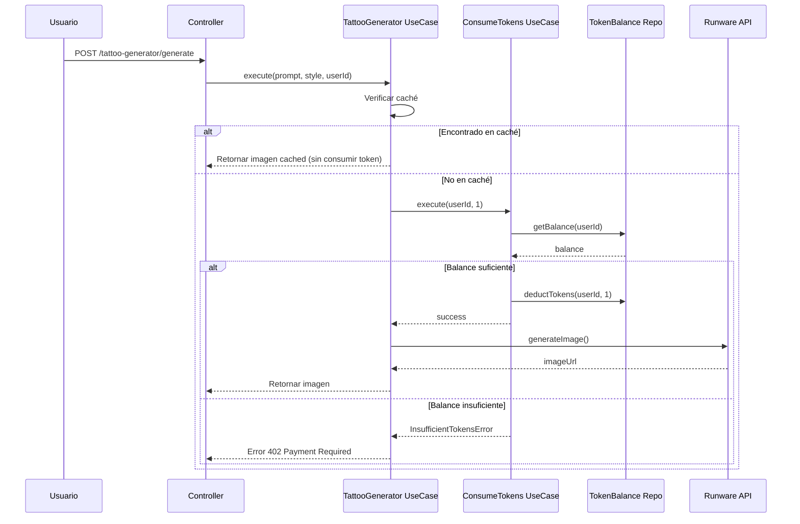
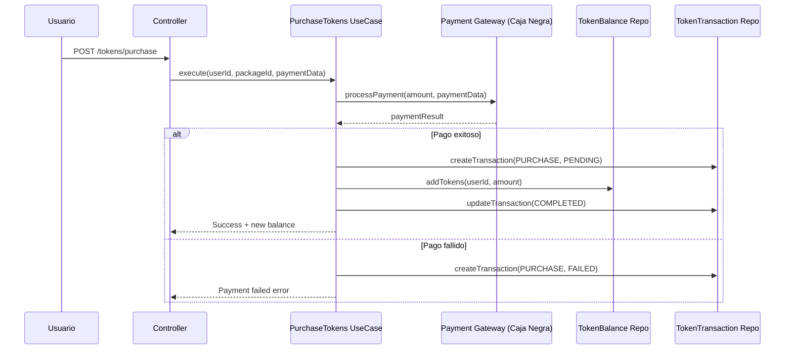

# Plan de Implementación: Sistema de Tokens para Generación de Imágenes

## 📋 Resumen Ejecutivo

Este documento describe el plan completo para implementar un sistema de tokens que limite la generación de imágenes de tatuajes en la plataforma Inker. Cada token permitirá generar una imagen, ayudando a controlar los costos de la API de Runware.

## 🎯 Objetivos

1. **Control de Costos**: Limitar el uso de la API de Runware para mantener los costos bajo control
2. **Monetización**: Permitir a los usuarios comprar tokens para generar más imágenes
3. **Experiencia de Usuario**: Mantener una buena UX informando claramente sobre tokens disponibles
4. **Escalabilidad**: Diseñar un sistema que pueda evolucionar (suscripciones, planes, etc.)

## 🏗️ Arquitectura del Sistema

### Módulos a Crear/Modificar

```
src/
├── tokens/                          # NUEVO MÓDULO
│   ├── domain/
│   │   ├── dtos/
│   │   │   ├── token-balance.dto.ts
│   │   │   └── token-transaction.dto.ts
│   │   ├── enums/
│   │   │   ├── transaction-type.enum.ts
│   │   │   └── transaction-status.enum.ts
│   │   ├── interfaces/
│   │   │   ├── token-repository.interface.ts
│   │   │   └── payment-gateway.interface.ts
│   │   ├── models/
│   │   │   ├── token-balance.model.ts
│   │   │   └── token-transaction.model.ts
│   │   └── errors/
│   │       └── insufficient-tokens.error.ts
│   ├── infrastructure/
│   │   ├── controllers/
│   │   │   └── tokens.controller.ts
│   │   ├── entities/
│   │   │   ├── token-balance.entity.ts
│   │   │   └── token-transaction.entity.ts
│   │   ├── repositories/
│   │   │   ├── token-balance.repository.ts
│   │   │   ├── token-transaction.repository.ts
│   │   │   └── tokenRepository.module.ts
│   │   └── services/
│   │       └── payment-gateway.service.ts  # Caja negra para integración futura
│   ├── usecases/
│   │   ├── consume-tokens.usecase.ts
│   │   ├── get-token-balance.usecase.ts
│   │   ├── grant-tokens.usecase.ts
│   │   ├── purchase-tokens.usecase.ts
│   │   └── get-transaction-history.usecase.ts
│   └── tokens.module.ts
├── tattoo-generator/                # MODIFICAR
│   └── usecases/
│       └── generateTattooImages.usecase.ts  # Integrar verificación de tokens
└── customers/                       # POTENCIAL MODIFICACIÓN
    └── infrastructure/
        └── entities/
            └── customer.entity.ts   # Considerar agregar relación con balance
```

### Base de Datos

Siguiendo la estrategia multi-DB del proyecto, el sistema de tokens usará su propia base de datos: `tokens-db`

#### Entidades

**TokenBalance**
```typescript
{
  id: string;                // UUID
  userId: string;            // Referencia al User
  userType: UserType;        // CUSTOMER, ARTIST, ADMIN
  userTypeId: string;        // ID específico en customer-db o artist-db
  balance: number;           // Tokens disponibles
  totalPurchased: number;    // Total histórico comprado
  totalConsumed: number;     // Total histórico consumido
  totalGranted: number;      // Total regalado/promocional
  lastPurchaseAt?: Date;
  createdAt: Date;
  updatedAt: Date;
}
```

**TokenTransaction**
```typescript
{
  id: string;                      // UUID
  userId: string;
  userType: UserType;
  userTypeId: string;              // ID específico en customer-db o artist-db
  type: TransactionType;           // PURCHASE, CONSUME, GRANT, REFUND, MANUAL_ADJUSTMENT
  amount: number;                  // Positivo para entrada, negativo para salida
  balanceBefore: number;
  balanceAfter: number;
  status: TransactionStatus;       // PENDING, COMPLETED, FAILED, REFUNDED
  metadata: {
    // Para PURCHASE
    paymentMethod?: string;
    paymentReference?: string;
    packageId?: string;
    price?: number;
    currency?: string;
    
    // Para CONSUME
    tattooGenerationId?: string;
    imageUrl?: string;
    prompt?: string;
    runwareCost?: number;        // Costo real de Runware
    
    // Para GRANT o MANUAL_ADJUSTMENT
    reason?: string;
    grantedBy?: string;
    adminUserId?: string;        // Para auditoría
    promotionId?: string;
  };
  ipAddress?: string;            // Para auditoría
  userAgent?: string;            // Para auditoría
  createdAt: Date;
  updatedAt: Date;
}
```

#### Scripts SQL de Migración

```sql
-- Crear base de datos
CREATE DATABASE inker_tokens;

-- Conectar a la base de datos
\c inker_tokens;

-- Crear extensión UUID
CREATE EXTENSION IF NOT EXISTS "uuid-ossp";

-- Tabla token_balance
CREATE TABLE token_balance (
    id UUID PRIMARY KEY DEFAULT uuid_generate_v4(),
    user_id VARCHAR(255) NOT NULL,
    user_type VARCHAR(50) NOT NULL CHECK (user_type IN ('CUSTOMER', 'ARTIST', 'ADMIN')),
    user_type_id VARCHAR(255) NOT NULL,
    balance INTEGER NOT NULL DEFAULT 0 CHECK (balance >= 0),
    total_purchased INTEGER NOT NULL DEFAULT 0,
    total_consumed INTEGER NOT NULL DEFAULT 0,
    total_granted INTEGER NOT NULL DEFAULT 0,
    last_purchase_at TIMESTAMP,
    created_at TIMESTAMP NOT NULL DEFAULT CURRENT_TIMESTAMP,
    updated_at TIMESTAMP NOT NULL DEFAULT CURRENT_TIMESTAMP,
    UNIQUE(user_id),
    INDEX idx_user_type_id (user_type_id),
    INDEX idx_user_type (user_type),
    INDEX idx_balance (balance),
    INDEX idx_created_at (created_at)
);

-- Tabla token_transaction
CREATE TABLE token_transaction (
    id UUID PRIMARY KEY DEFAULT uuid_generate_v4(),
    user_id VARCHAR(255) NOT NULL,
    user_type VARCHAR(50) NOT NULL CHECK (user_type IN ('CUSTOMER', 'ARTIST', 'ADMIN')),
    user_type_id VARCHAR(255) NOT NULL,
    type VARCHAR(50) NOT NULL CHECK (type IN ('PURCHASE', 'CONSUME', 'GRANT', 'REFUND', 'MANUAL_ADJUSTMENT')),
    amount INTEGER NOT NULL,
    balance_before INTEGER NOT NULL,
    balance_after INTEGER NOT NULL,
    status VARCHAR(50) NOT NULL CHECK (status IN ('PENDING', 'COMPLETED', 'FAILED', 'REFUNDED')),
    metadata JSONB NOT NULL DEFAULT '{}',
    ip_address VARCHAR(45),
    user_agent TEXT,
    created_at TIMESTAMP NOT NULL DEFAULT CURRENT_TIMESTAMP,
    updated_at TIMESTAMP NOT NULL DEFAULT CURRENT_TIMESTAMP,
    INDEX idx_user_id (user_id),
    INDEX idx_user_type_id (user_type_id),
    INDEX idx_type (type),
    INDEX idx_status (status),
    INDEX idx_created_at (created_at),
    INDEX idx_metadata_gin (metadata) USING gin
);

-- Trigger para actualizar updated_at
CREATE OR REPLACE FUNCTION update_updated_at_column()
RETURNS TRIGGER AS $$
BEGIN
    NEW.updated_at = CURRENT_TIMESTAMP;
    RETURN NEW;
END;
$$ language 'plpgsql';

CREATE TRIGGER update_token_balance_updated_at BEFORE UPDATE
    ON token_balance FOR EACH ROW EXECUTE FUNCTION update_updated_at_column();

CREATE TRIGGER update_token_transaction_updated_at BEFORE UPDATE
    ON token_transaction FOR EACH ROW EXECUTE FUNCTION update_updated_at_column();

-- Crear índice para búsquedas de auditoría
CREATE INDEX idx_transaction_audit ON token_transaction(created_at, user_id, type, status);

-- Crear vista para auditoría de administradores
CREATE VIEW admin_manual_adjustments AS
SELECT 
    t.id,
    t.user_id,
    t.user_type,
    t.user_type_id,
    t.amount,
    t.balance_before,
    t.balance_after,
    t.metadata->>'reason' as reason,
    t.metadata->>'adminUserId' as admin_user_id,
    t.ip_address,
    t.created_at
FROM token_transaction t
WHERE t.type = 'MANUAL_ADJUSTMENT'
ORDER BY t.created_at DESC;

-- Función para carga manual de tokens (MVP)
CREATE OR REPLACE FUNCTION grant_tokens_manual(
    p_user_id VARCHAR(255),
    p_user_type VARCHAR(50),
    p_user_type_id VARCHAR(255),
    p_amount INTEGER,
    p_reason TEXT,
    p_admin_user_id VARCHAR(255)
)
RETURNS TABLE(success BOOLEAN, new_balance INTEGER, transaction_id UUID) AS $$
DECLARE
    v_current_balance INTEGER;
    v_new_balance INTEGER;
    v_transaction_id UUID;
BEGIN
    -- Iniciar transacción
    BEGIN
        -- Obtener o crear balance
        INSERT INTO token_balance (user_id, user_type, user_type_id, balance, total_granted)
        VALUES (p_user_id, p_user_type, p_user_type_id, 0, 0)
        ON CONFLICT (user_id) DO NOTHING;
        
        -- Obtener balance actual con lock
        SELECT balance INTO v_current_balance
        FROM token_balance
        WHERE user_id = p_user_id
        FOR UPDATE;
        
        -- Calcular nuevo balance
        v_new_balance := v_current_balance + p_amount;
        
        -- Actualizar balance
        UPDATE token_balance
        SET balance = v_new_balance,
            total_granted = total_granted + p_amount,
            updated_at = CURRENT_TIMESTAMP
        WHERE user_id = p_user_id;
        
        -- Crear transacción
        INSERT INTO token_transaction (
            user_id, user_type, user_type_id, type, amount,
            balance_before, balance_after, status, metadata
        )
        VALUES (
            p_user_id, p_user_type, p_user_type_id, 'MANUAL_ADJUSTMENT', p_amount,
            v_current_balance, v_new_balance, 'COMPLETED',
            jsonb_build_object(
                'reason', p_reason,
                'adminUserId', p_admin_user_id,
                'grantedAt', CURRENT_TIMESTAMP
            )
        )
        RETURNING id INTO v_transaction_id;
        
        RETURN QUERY SELECT true, v_new_balance, v_transaction_id;
    EXCEPTION
        WHEN OTHERS THEN
            RETURN QUERY SELECT false, 0, NULL::UUID;
    END;
END;
$$ LANGUAGE plpgsql;

-- Ejemplos de uso para carga manual
-- GRANT: Dar 10 tokens a un usuario
-- SELECT * FROM grant_tokens_manual('user123', 'CUSTOMER', 'cust456', 10, 'Bono de bienvenida', 'admin789');

-- QUERY: Ver balance de un usuario
-- SELECT * FROM token_balance WHERE user_id = 'user123';

-- QUERY: Ver historial de transacciones
-- SELECT * FROM token_transaction WHERE user_id = 'user123' ORDER BY created_at DESC;

-- QUERY: Ver todas las cargas manuales
-- SELECT * FROM admin_manual_adjustments;
```

## 🔄 Flujos Principales

### 1. Generación de Imagen con Tokens



### 2. Compra de Tokens



## 📦 Paquetes de Tokens

### Configuración Inicial (Configurable)

```typescript
// Costo base: $0.06 USD por imagen de Runware
// Precio por token: ~$0.50 USD (8.3x markup para cubrir costos operacionales)
const TOKEN_PACKAGES = [
  {
    id: 'starter',
    name: 'Paquete Inicial',
    tokens: 10,
    price: 5.00,
    currency: 'USD',
    pricePerToken: 0.50,
    savings: 0,
    description: 'Perfecto para probar el servicio'
  },
  {
    id: 'popular',
    name: 'Paquete Popular',
    tokens: 25,
    price: 10.00,
    currency: 'USD',
    pricePerToken: 0.40,
    savings: 20,
    badge: 'MÁS POPULAR',
    description: 'Ideal para usuarios regulares'
  },
  {
    id: 'pro',
    name: 'Paquete Pro',
    tokens: 60,
    price: 20.00,
    currency: 'USD',
    pricePerToken: 0.33,
    savings: 33,
    description: 'Para diseñadores frecuentes'
  },
  {
    id: 'enterprise',
    name: 'Paquete Empresa',
    tokens: 150,
    price: 40.00,
    currency: 'USD',
    pricePerToken: 0.27,
    savings: 47,
    description: 'Mejor valor para uso intensivo'
  }
];

// Configuración de costos y márgenes
const PRICING_CONFIG = {
  runwareCostPerImage: 0.06,      // Costo real de Runware
  minProfitMargin: 5.0,           // Margen mínimo 5x
  targetProfitMargin: 8.3,        // Margen objetivo 8.3x
  welcomeTokens: 3,               // Tokens gratis al registrarse
  referralTokens: 2,              // Tokens por referir a un amigo
  monthlyFreeTokens: 0,           // Sin tokens mensuales gratis en MVP
};
```

### Justificación de Precios

- **Costo Runware**: $0.06 por imagen
- **Precio base token**: $0.50 (starter pack)
- **Margen**: 8.3x para cubrir:
  - Infraestructura AWS/hosting
  - Desarrollo y mantenimiento
  - Soporte al cliente
  - Marketing y crecimiento
  - Margen de ganancia

### Descuentos por Volumen

| Paquete | Tokens | Precio Total | Precio/Token | Ahorro |
|---------|---------|--------------|--------------|---------|
| Starter | 10 | $5.00 | $0.50 | 0% |
| Popular | 25 | $10.00 | $0.40 | 20% |
| Pro | 60 | $20.00 | $0.33 | 33% |
| Enterprise | 150 | $40.00 | $0.27 | 47% |

## 🚀 Plan de Implementación

### Fase 1: Infraestructura Base (3-4 días) ✅ COMPLETADA

1. **Configuración de Base de Datos**
   - [x] Crear configuración para `tokens-db`
   - [x] Actualizar `database.module.ts` y constantes
   - [x] ~~Crear migraciones iniciales~~ (Base de datos ya creada manualmente)

2. **Módulo de Tokens**
   - [x] Crear estructura de carpetas
   - [x] Implementar entidades TypeORM
   - [x] Crear DTOs y modelos de dominio
   - [x] Implementar repositorios
   - [x] Crear TokenRepositoryModule

3. **Use Cases Básicos**
   - [x] GetTokenBalance
   - [x] ConsumeTokens
   - [x] GrantTokens (para testing y promociones)

### Fase 2: Integración con Generador (2-3 días) ✅ PARCIALMENTE COMPLETADA

1. **Modificar TattooGenerator** ✅
   - [x] Inyectar ConsumeTokens UseCase
   - [x] Agregar verificación de balance antes de generar
   - [x] Manejar InsufficientTokensError
   - [x] Actualizar respuestas para incluir balance restante

2. **Integración con Creación de Usuarios** ✅
   - [x] Modificar `CreateUserByTypeUseCase` para otorgar tokens de bienvenida
   - [x] Inyectar GrantTokens UseCase
   - [x] Agregar lógica después de crear Customer/Artist exitosamente
   - [x] Configurar cantidad de tokens via ConfigService

3. **Testing** ⏳ PENDIENTE
   - [ ] Tests unitarios para use cases
   - [ ] Tests de integración
   - [ ] Tests E2E del flujo completo

### Fase 3: API de Compra (2-3 días)

1. **Controllers y Endpoints**
   - [ ] GET /tokens/balance
   - [ ] GET /tokens/packages
   - [ ] POST /tokens/purchase
   - [ ] GET /tokens/transactions

2. **Payment Gateway (Caja Negra)**
   - [ ] Crear interfaz IPaymentGateway
   - [ ] Implementar MockPaymentGateway para desarrollo
   - [ ] Documentar requerimientos para integración real

### Fase 4: Funcionalidades Adicionales (2-3 días)

1. **Sistema de Notificaciones**
   - [ ] Notificar cuando quedan pocos tokens
   - [ ] Confirmación de compra por email
   - [ ] Historial de transacciones

2. **Admin Features**
   - [ ] Endpoint para grant/revoke tokens
   - [ ] Dashboard de métricas
   - [ ] Gestión de paquetes

3. **Promociones**
   - [ ] Tokens de bienvenida para nuevos usuarios
   - [ ] Sistema de códigos promocionales
   - [ ] Tokens por referidos

## 🎁 Sistema de Tokens de Bienvenida

### Implementación en CreateUserByTypeUseCase

```typescript
// src/users/usecases/user/createUserByType.usecase.ts
import { GrantTokensUseCase } from '../../../tokens/usecases/grant-tokens.usecase.ts';

@Injectable()
export class CreateUserByTypeUseCase extends BaseUseCase implements UseCase {
  constructor(
    // ... otros servicios ...
    private readonly grantTokensUseCase: GrantTokensUseCase,
    private readonly configService: ConfigService,
  ) {
    super(CreateUserByTypeUseCase.name);
  }

  public async execute(
    createUserParams: CreateUserByTypeParams,
  ): Promise<CreateCustomerUserResDto | CreateArtistUserResDto> {
    // ... lógica existente de creación ...

    try {
      const response = await this.handleCreateByUserType(
        created.id,
        createUserParams,
      );

      // Otorgar tokens de bienvenida
      await this.grantWelcomeTokens(created.id, createUserParams.userType, response);

      if (response instanceof Artist) {
        const resp = await TypeTransform.to(CreateArtistUserResDto, response);
        this.logger.log(`🟢 Artist created: ${stringify(resp)}`);
        return resp;
      }

      const resp = await TypeTransform.to(CreateCustomerUserResDto, response);
      this.logger.log(`🟢 Customer created: ${stringify(resp)}`);
      return resp;
    } catch (error) {
      await this.handleCreateError(created.id, error as DomainException);
      throw error;
    }
  }

  private async grantWelcomeTokens(
    userId: string,
    userType: UserType,
    createdEntity: Customer | Artist,
  ): Promise<void> {
    try {
      const welcomeTokens = this.configService.get<number>('TOKENS_WELCOME_BONUS', 3);
      
      if (welcomeTokens > 0) {
        const userTypeId = createdEntity.id; // ID del Customer o Artist creado
        
        await this.grantTokensUseCase.execute({
          userId,
          userType,
          userTypeId,
          amount: welcomeTokens,
          reason: 'Bono de bienvenida - Registro nuevo usuario',
          metadata: {
            promotionType: 'WELCOME_BONUS',
            registrationDate: new Date(),
          },
        });
        
        this.logger.log(`🎁 Welcome tokens granted: ${welcomeTokens} tokens to user ${userId}`);
      }
    } catch (error) {
      // No fallar la creación del usuario si falla el otorgamiento de tokens
      this.logger.error(`Failed to grant welcome tokens to user ${userId}`, error);
    }
  }
}
```

### Configuración

```env
# Tokens de bienvenida
TOKENS_WELCOME_BONUS=3    # Cantidad de tokens gratis al registrarse
```

### Consideraciones

1. **No Bloquear Registro**: Si falla el otorgamiento de tokens, el usuario se crea igual
2. **Idempotencia**: Verificar que no se otorguen tokens duplicados si se reintenta
3. **Auditoría**: Todas las bonificaciones quedan registradas con tipo 'GRANT'
4. **Notificación**: Considerar enviar email de bienvenida mencionando los tokens gratis

## 🔧 MVP: Carga Manual de Tokens

Para el MVP inicial, la carga de tokens se realizará manualmente mediante acceso directo a la base de datos. Esta sección proporciona las herramientas necesarias para administrar tokens mientras se desarrolla la integración con la pasarela de pagos.

### Herramientas de Administración Manual

#### 1. Función SQL para Carga Manual
```sql
-- Cargar tokens a un usuario específico
SELECT * FROM grant_tokens_manual(
    'user-id-aqui',           -- user_id del sistema de auth
    'CUSTOMER',               -- user_type: CUSTOMER, ARTIST, o ADMIN
    'customer-id-aqui',       -- ID en la base de datos específica
    50,                       -- cantidad de tokens a agregar
    'Compra manual - Paquete Pro', -- razón/descripción
    'admin-user-id'           -- ID del admin que hace la carga
);
```

#### 2. Endpoint Administrativo con Token Secreto
```typescript
// POST /tokens/admin/grant
// Requiere header: X-Admin-Token: {TOKEN_SECRETO}
{
  "userId": "user123",
  "userType": "CUSTOMER",
  "userTypeId": "cust456",
  "amount": 50,
  "reason": "Compra manual - Transferencia bancaria #12345"
}

// Implementación del controller
@Controller('tokens')
export class TokensAdminController {
  constructor(
    private readonly grantTokensUseCase: GrantTokensUseCase,
    private readonly configService: ConfigService,
  ) {}

  @Post('admin/grant')
  @HttpCode(HttpStatus.OK)
  async grantTokens(
    @Headers('x-admin-token') adminToken: string,
    @Body() dto: GrantTokensDto,
    @Ip() ipAddress: string,
    @Headers('user-agent') userAgent: string,
  ) {
    // Validar token secreto
    const secretToken = this.configService.get<string>('TOKENS_ADMIN_SECRET');
    if (!adminToken || adminToken !== secretToken) {
      throw new UnauthorizedException('Invalid admin token');
    }

    // Ejecutar caso de uso con metadata de auditoría
    return this.grantTokensUseCase.execute({
      ...dto,
      metadata: {
        ipAddress,
        userAgent,
        grantedVia: 'ADMIN_ENDPOINT',
        timestamp: new Date(),
      },
    });
  }
}
```

#### Variable de entorno requerida:
```env
# Token secreto para endpoint administrativo
TOKENS_ADMIN_SECRET=tu-token-super-secreto-aqui-cambialo
```

#### 3. Scripts de Administración
```bash
# Script para carga masiva (crear archivo scripts/grant-tokens.sql)
psql -h localhost -U postgres -d inker_tokens -f scripts/grant-tokens.sql

# Contenido ejemplo de grant-tokens.sql:
-- Carga de tokens para usuarios que pagaron por transferencia
SELECT * FROM grant_tokens_manual('user1', 'CUSTOMER', 'cust1', 25, 'Pago por transferencia - Ref: 001', 'admin1');
SELECT * FROM grant_tokens_manual('user2', 'ARTIST', 'art2', 60, 'Pago por transferencia - Ref: 002', 'admin1');
```

#### 4. Queries Útiles para Administración
```sql
-- Ver todos los usuarios con su balance actual
SELECT 
    tb.user_id,
    tb.user_type,
    tb.user_type_id,
    tb.balance,
    tb.total_purchased,
    tb.total_consumed,
    tb.total_granted,
    tb.updated_at
FROM token_balance tb
ORDER BY tb.updated_at DESC;

-- Ver cargas manuales del último mes
SELECT * FROM admin_manual_adjustments
WHERE created_at >= CURRENT_DATE - INTERVAL '30 days';

-- Estadísticas generales
SELECT 
    COUNT(DISTINCT user_id) as total_users,
    SUM(balance) as total_tokens_in_circulation,
    SUM(total_consumed) as total_tokens_consumed,
    SUM(total_granted) as total_tokens_granted
FROM token_balance;

-- Usuarios con bajo balance (menos de 5 tokens)
SELECT user_id, user_type, balance 
FROM token_balance 
WHERE balance < 5 AND balance > 0
ORDER BY balance ASC;
```

### Proceso Manual para MVP

1. **Cliente solicita tokens**:
   - Por email/WhatsApp indica paquete deseado
   - Realiza transferencia bancaria o pago manual

2. **Administrador verifica pago**:
   - Confirma recepción del pago
   - Identifica usuario y paquete

3. **Carga de tokens**:
   ```sql
   -- Ejemplo: Usuario compró paquete "Popular" (25 tokens)
   SELECT * FROM grant_tokens_manual(
       'abc123',
       'CUSTOMER',
       'cust789',
       25,
       'Compra Paquete Popular - Trans #45678',
       'admin001'
   );
   ```

4. **Notificación al usuario**:
   - Email manual confirmando la carga
   - Usuario puede verificar en la app

### Logging y Auditoría

Todas las cargas manuales quedan registradas automáticamente:
- Vista `admin_manual_adjustments` para auditoría
- Metadata incluye admin que realizó la carga
- Timestamp y razón de la carga
- Balance antes y después

## 🔧 Configuración y Variables de Entorno

```env
# Token System
TOKENS_FREE_MONTHLY_LIMIT=0          # Tokens gratuitos por mes (0 para MVP)
TOKENS_WELCOME_BONUS=3               # Tokens de bienvenida al registrarse
TOKENS_REFERRAL_BONUS=2              # Tokens por referido
TOKENS_ADMIN_SECRET=tu-token-super-secreto-aqui-cambialo  # Token secreto para endpoint admin

# Token Database
TOKENS_DB_HOST=localhost
TOKENS_DB_PORT=5432
TOKENS_DB_USERNAME=tokens_user
TOKENS_DB_PASSWORD=tokens_pass
TOKENS_DB_DATABASE=inker_tokens

# Payment Gateway (Futuro)
PAYMENT_GATEWAY_PROVIDER=stripe      # stripe, paypal, mercadopago, etc.
PAYMENT_GATEWAY_API_KEY=
PAYMENT_GATEWAY_SECRET=
PAYMENT_GATEWAY_WEBHOOK_SECRET=
```

## 🛡️ Consideraciones de Seguridad

1. **Validación de Transacciones**
   - Usar transacciones de DB para operaciones atómicas
   - Implementar idempotency keys para evitar duplicados
   - Audit log de todas las transacciones

2. **Rate Limiting**
   - Limitar intentos de compra por usuario
   - Prevenir consumo masivo de tokens

3. **Encriptación**
   - Encriptar datos sensibles de pago
   - Usar HTTPS para todos los endpoints

## 📋 Sistema de Auditoría y Logs

### Niveles de Logging

1. **Transacciones Críticas** (ERROR/WARN)
   ```typescript
   // Fallo en consumo de tokens
   this.logger.error('Failed to consume tokens', {
     userId,
     userTypeId,
     requestedAmount: 1,
     currentBalance,
     error: error.message,
     stack: error.stack
   });
   ```

2. **Transacciones Exitosas** (INFO)
   ```typescript
   // Consumo exitoso
   this.logger.info('Tokens consumed successfully', {
     userId,
     userTypeId,
     amount: 1,
     balanceBefore,
     balanceAfter,
     transactionId,
     imageGenerationId
   });
   ```

3. **Operaciones Administrativas** (INFO con metadata especial)
   ```typescript
   // Carga manual
   this.logger.info('Manual token grant', {
     action: 'MANUAL_GRANT',
     adminUserId,
     targetUserId,
     targetUserTypeId,
     amount,
     reason,
     ipAddress: request.ip,
     userAgent: request.headers['user-agent']
   });
   ```

### Queries de Auditoría

```sql
-- Reporte diario de actividad
SELECT 
    DATE(created_at) as date,
    type,
    COUNT(*) as transaction_count,
    SUM(CASE WHEN amount > 0 THEN amount ELSE 0 END) as tokens_added,
    SUM(CASE WHEN amount < 0 THEN ABS(amount) ELSE 0 END) as tokens_consumed
FROM token_transaction
WHERE created_at >= CURRENT_DATE - INTERVAL '7 days'
GROUP BY DATE(created_at), type
ORDER BY date DESC, type;

-- Usuarios sospechosos (alto consumo)
SELECT 
    user_id,
    user_type,
    COUNT(*) as transactions_last_hour,
    SUM(ABS(amount)) as tokens_moved
FROM token_transaction
WHERE created_at >= NOW() - INTERVAL '1 hour'
    AND type = 'CONSUME'
GROUP BY user_id, user_type
HAVING COUNT(*) > 20  -- Más de 20 generaciones en 1 hora
ORDER BY transactions_last_hour DESC;

-- Rastreo completo de un usuario
SELECT 
    t.created_at,
    t.type,
    t.amount,
    t.balance_before,
    t.balance_after,
    t.status,
    t.metadata,
    t.ip_address
FROM token_transaction t
WHERE t.user_id = 'USER_ID_AQUI'
ORDER BY t.created_at DESC
LIMIT 50;
```

### Alertas Automáticas

Configurar alertas para:
- Consumo anormal (>50 tokens en 1 hora)
- Fallos repetidos de transacciones
- Cargas manuales grandes (>100 tokens)
- Intentos de consumo con balance insuficiente repetidos

## 📊 Métricas y Monitoreo

### KPIs a Trackear

1. **Uso de Tokens**
   - Tokens consumidos por día/semana/mes
   - Ratio de usuarios con/sin tokens
   - Promedio de tokens por usuario

2. **Monetización**
   - Ingresos por paquete
   - Conversión free-to-paid
   - LTV por usuario

3. **Técnicas**
   - Latencia de generación con verificación
   - Tasa de error en pagos
   - Cache hit rate

### Implementación de Métricas

```typescript
// Ejemplo de evento para analytics
await this.analyticsQueue.add('token_consumed', {
  userId,
  userType,
  remainingBalance,
  imageGenerated: true,
  timestamp: new Date()
});
```

## 🔄 Migración y Rollout

### Estrategia de Migración

1. **Fase Beta (Semana 1-2)**
   - Activar solo para usuarios nuevos
   - Otorgar tokens gratuitos generosos
   - Recopilar feedback

2. **Migración Gradual (Semana 3-4)**
   - Migrar usuarios existentes por grupos
   - Otorgar bonus de migración
   - Monitorear métricas

3. **Lanzamiento Completo (Semana 5+)**
   - Activar para todos los usuarios
   - Ajustar precios según datos
   - Implementar promociones

### Rollback Plan

- Feature flags para activar/desactivar sistema
- Backup de estado pre-migración
- Scripts para revertir balances

## 🚦 Próximos Pasos

1. **Validar el Plan**
   - Review con equipo técnico
   - Aprobación de producto
   - Definir prioridades

2. **Seleccionar Payment Gateway**
   - Evaluar opciones (Stripe, PayPal, MercadoPago)
   - Considerar fees y cobertura geográfica
   - Revisar requisitos de compliance

3. **Comenzar Implementación**
   - Crear branch `feature/token-system`
   - Implementar Fase 1
   - Daily standups para tracking

## 📝 Notas Adicionales

### Extensiones Futuras

1. **Suscripciones**
   - Planes mensuales con tokens incluidos
   - Descuentos por suscripción anual
   - Tokens que no expiran vs. que expiran

2. **Marketplace**
   - Vender/intercambiar tokens entre usuarios
   - Tokens como recompensa por contenido

3. **Gamificación**
   - Achievements que otorgan tokens
   - Daily login bonus
   - Challenges semanales

### Consideraciones de UX

1. **Transparencia**
   - Mostrar balance en header/navbar
   - Preview antes de consumir token
   - Historial claro de uso

2. **Educación**
   - Onboarding sobre sistema de tokens
   - FAQ sobre compra y uso
   - Soporte dedicado

3. **Incentivos**
   - Primera compra con descuento
   - Bulk discounts evidentes
   - Urgencia con ofertas limitadas

---

**Documento creado por**: Sistema de IA
**Fecha**: 2025-06-23
**Estado**: BORRADOR - Pendiente de revisión