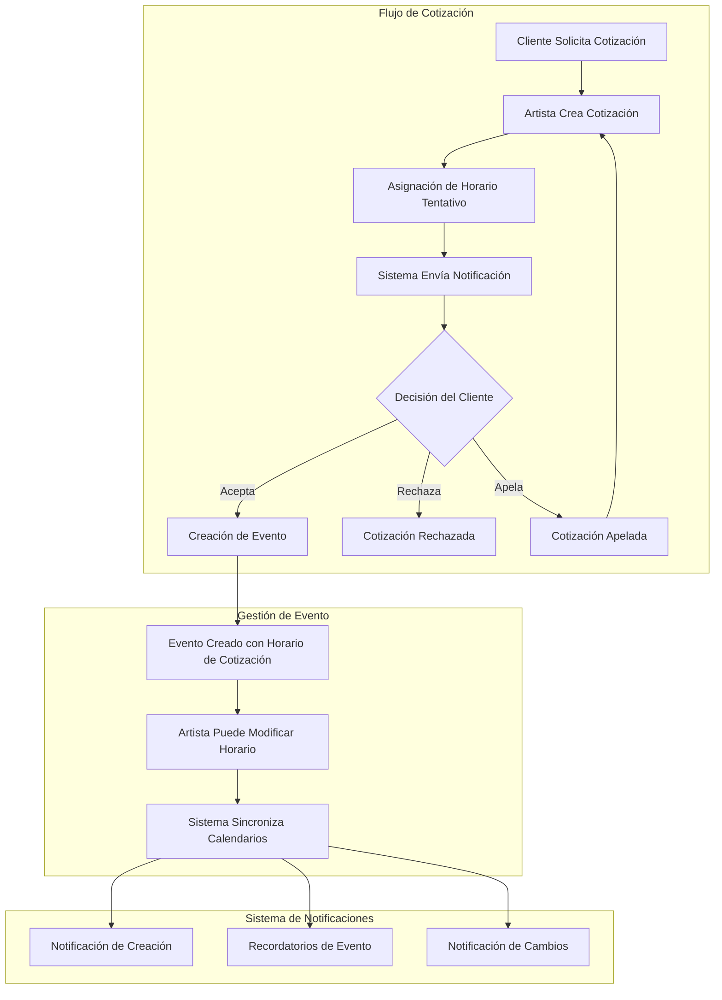
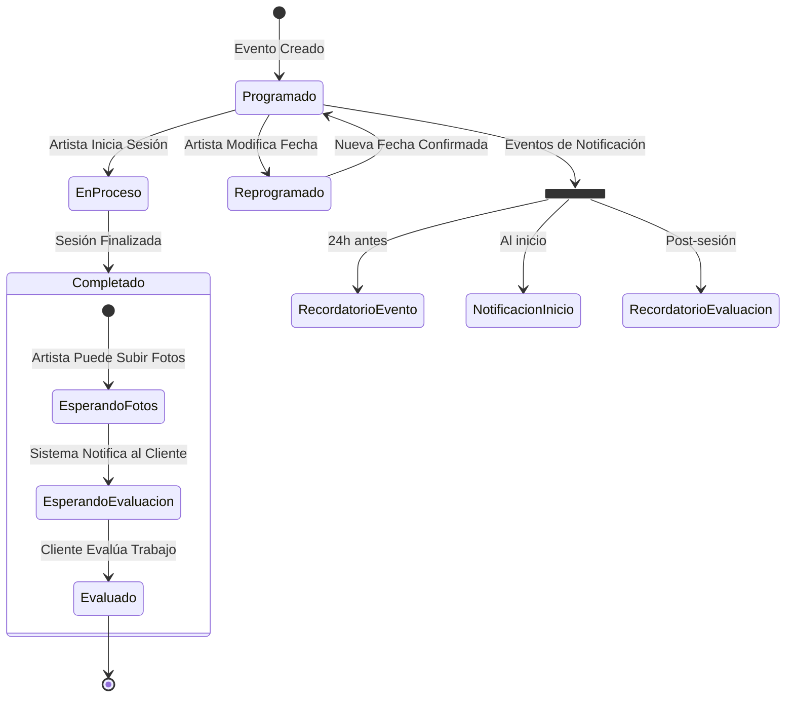

Entiendo perfectamente - vamos a simplificar el sistema para crear un MVP más enfocado y manejable. El flujo principal sería:

1. Cotización → Evento → Seguimiento → Evaluación
2. El horario se establece inicialmente en la cotización
3. No hay pagos ni restricciones complejas de calendario
4. Enfoque en los estados del evento y las notificaciones clave

Vamos a actualizar los diagramas para reflejar este flujo más simplificado:

Ahora, actualicemos el diagrama de estados del evento para incluir el proceso de evaluación:

Basado en estos flujos actualizados, estos serían los elementos clave a implementar:

1. Sistema de Eventos:
   - Creación automática desde cotización aceptada
   - Hereda el horario de la cotización
   - Estados principales: Programado → EnProceso → Completado → Evaluado
   - Opción para que el artista modifique el horario
   - Sistema simple de subida de fotos post-trabajo

2. Sistema de Notificaciones:
   - Notificación de creación de evento
   - Recordatorio 24 horas antes
   - Notificación al inicio del evento
   - Notificación de cambios de horario
   - Recordatorio para evaluación post-servicio

3. Interfaz de Usuario:
   - Vista de calendario simple para artista y cliente
   - Panel de estado del evento
   - Interfaz para subir fotos del trabajo
   - Sistema de evaluación para el cliente

4. Estados del Artista:
   - Indicador de "Tatuando" cuando está en sesión
   - Opción para marcar trabajo como completado
   - Opción para subir fotos del trabajo realizado

¿Te gustaría que profundicemos en alguno de estos aspectos? Podríamos detallar más la estructura de datos necesaria o las notificaciones específicas para cada estado.