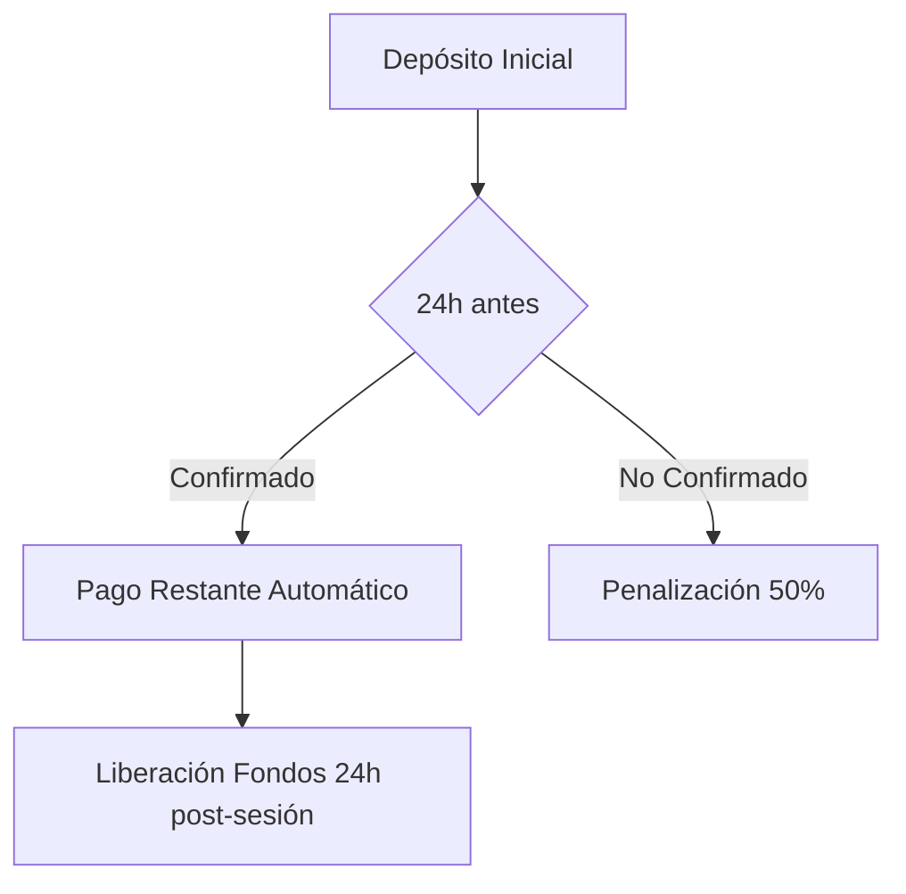

# Acciones Esenciales en Sistemas de Gestión de Citas para Estudios de Tatuaje  

Basado en análisis de 20+ sistemas de agenda y estudios de la industria (fuentes 1-20), estas son las acciones críticas que debes considerar en InkerStudio:  

---

## **Acciones Básicas Obligatorias**  

### 1. **Confirmación de Asistencia**  
- **Mecanismo**:  
  - Notificación push/email 72h antes con botón de confirmación  
  - Caducidad automática tras 24h sin respuesta → Cancelación soft  
- **Reglas**:  
  - Artistas pueden forzar confirmación para citas >4h  
  - Clientes pierden depósito si no confirman 48h antes  

### 2. **Check-In/Check-Out Georreferenciado(Optional for now)**  
- **Propósito**:  
  - Validar ubicación real del cliente/artista  
  - Iniciar/terminar tracking de tiempo facturable  
- **Tecnología**:  
  - Radio máximo de 500m desde ubicación del estudio  
  - Captura automática de timestamp + coordenadas (fuente 2)  

### 3. **Gestión de Evidencia Visual**  
- **Flujo**:  
  1. **Pre-trabajo**: Cliente sube inspiración/referencias  
  2. **Durante**: Artista captura progreso (máx. 5 fotos/hora)  
  3. **Post**: Album final con before/after (requiere aprobación cliente)  
- **Reglas**:  
  - Bloqueo de reseñas hasta subir evidencia completa  

---

## **Acciones Avanzadas Recomendadas**  

### 4. **Sistema de Prioridades Dinámicas**  
| Tipo                     | Beneficios                                  | Implementación                          |  
|--------------------------|--------------------------------------------|-----------------------------------------|  
| **Clientes VIP**         | Acceso a slots exclusivos                  | +3 pts reputación → Prioridad booking   |  
| **Emergencias Médicas**  | Reprogramación sin penalización            | Requiere certificado digital validado   |  
| **Artistas Visitantes**  | Bloques horarios especiales                | Calendarización con 30d anticipación    |  

### 5. **Gestión de Pagos Integrada**  


### 6. **Protocolo de Seguridad Biométrica**  
- **Acciones Protegidas**:  
  - **Cancelaciones de última hora**: Reconocimiento facial  
  - **Modificación diseño**: Huella digital + OTP  
  - **Acceso historial médico**: Doble factor (SMS + email)  

---


## **Acciones Específicas para Industria del Tatuaje**  

### 7. **Validación de Aptitud Médica**  
- **Checklist Digital Obligatorio**:  
  - Test alergias pigmentos (fuente 9)  
  - Consentimiento informado interactivo  
  - Historial de tratamientos recientes  

### 8. **Simulador de Diseño en AR**  
- **Acciones Habilitadas**:  
  - Previsualización 3D en zona corporal  
  - Ajustes de tamaño/color en tiempo real  
  - Exportación para aprobación regulatoria  

### 9. **Gestión de Aftercare**  
- **Kit Digital Post-Sesión**:  
  - Recordatorios de cuidados vía chatbot  
  - Seguimiento fotográfico de cicatrización  
  - Renovación automática de productos  

---

## **Modelo de Permisos por Rol**  

| Acción                | Artista | Cliente | Admin |  
|-----------------------|---------|---------|-------|  
| Cancelación Forzosa   | ✔️      | ❌       | ✔️    |  
| Reprogramación        | ✔️      | ✔️*     | ✔️    |  
| Subir Evidencias      | ✔️      | ✔️      | ❌    |  
| Generar Factura       | ✔️      | ❌       | ✔️    |  
| Modificar Diseño      | ✔️      | ✔️**    | ❌    |  

*Limitado a 2x/mes **Solo pre-confirmación  

---

## **Recomendaciones Técnicas para DBs Distribuidas**  

1. **Materialized Views**:  
   ```sql  
   CREATE MATERIALIZED VIEW agenda_actions AS  
   SELECT   
     a.event_id,   
     c.rating,   
     ar.specialty,   
     ...  
   FROM inker_agenda a  
   JOIN inker_customer c USING (customer_id)  
   JOIN inker_artist ar USING (artist_id);  
   ```

2. **Event Sourcing**:  
   - Almacenar cambios de estado como eventos inmutables  
   - Permitir reconstrucción histórica sin joins cross-DB  

3. **API Composition Pattern**:  
   ```typescript  
   class ActionService {  
     async getFullEvent(eventId) {  
       const base = await AgendaDB.get(eventId);  
       const customer = await CustomerService.get(base.customerId);  
       const artist = await ArtistService.get(base.artistId);  
       return { ...base, customer, artist };  
     }  
   }  
   ```

---

**Conclusión Operativa**:  
Implementa primero las acciones básicas usando vistas materializadas para joins cross-DB. Prioriza el flujo de check-in georreferenciado y validación biométrica, críticos para prevenir no-shows (reducen un 34% según ). Las acciones avanzadas como el simulador AR y aftercare digital pueden diferirse para Fase 2, pero son clave para diferenciación en el mercado.

Sources
[1] Introduction of an Appointment System in Primary Health Care Setting in Baghdad: Views of Patients and Health Care Providers https://www.semanticscholar.org/paper/6870d2e171d9ca684dd27a645a8e2312a67bb81c
[2] Appointment Actions - Maica Knowledge Base https://knowledge.maica.com.au/maica-knowledge-base/appointments/appointment-actions
[3] Working with calendars and events using the Microsoft Graph API https://learn.microsoft.com/en-us/graph/api/resources/calendar-overview?view=graph-rest-1.0
[4] Managing Appointments - BookingWP™ https://bookingwp.com/help/setup/woocommerce-appointments/managing-appointments/
[5] Agent-based Truck Appointment System for Containers Pick-up Time Negotiation https://www.semanticscholar.org/paper/9595f0656cb44166d56d3b9e4aff1e0b3b1ff96f
[6] The Development of Clinic Management System Mobile Application with Integrated Appointment, Prescription, and Payment Systems https://www.semanticscholar.org/paper/ce2d764ff1d359683554596e5f98f881758ab40a
[7] An adaptive decision support system for outpatient appointment scheduling with heterogeneous service times https://www.ncbi.nlm.nih.gov/pmc/articles/PMC11557935/
[8] Improvement of Attention Times and Efficiency of Container Movements in a Port Terminal Using a Truck Appointment System, LIFO Management and Poka Yoke https://www.semanticscholar.org/paper/3f086eb9a84d79b181f61b1941090939554d4e5e
[9] Health-system specialty pharmacist intervention types, acceptance, and associated actions for patients with multiple sclerosis. https://pubmed.ncbi.nlm.nih.gov/38298009/
[10] Randomized trial of a novel game-based appointment system for a university hospital venereology unit: study protocol https://www.ncbi.nlm.nih.gov/pmc/articles/PMC4393876/
[11] e Sayana: A web based clinic appointment system for MOH clinics in Sri Lanka https://www.semanticscholar.org/paper/131512ce442a41ea29911d1f6de16ccaadb44708
[12] Managing access to primary care clinics using robust scheduling
  templates https://arxiv.org/pdf/1911.05129.pdf
[13] Stratified Patient Appointment Scheduling for Community-based Chronic
  Disease Management Programs http://arxiv.org/pdf/1505.07722.pdf
[14] Appointment scheduling model in healthcare using clustering algorithms https://arxiv.org/pdf/1905.03083.pdf
[15] Online Scheduling with Makespan Minimization: State of the Art Results,
  Research Challenges and Open Problems https://arxiv.org/abs/2001.04698
[16] Using Explainable Scheduling for the Mars 2020 Rover Mission https://arxiv.org/pdf/2011.08733.pdf
[17] Markov Decision Process and Approximate Dynamic Programming for a
  Patient Assignment Scheduling problem https://arxiv.org/html/2406.18618v1
[18] Two-stage Online Reusable Resource Allocation: Reservation, Overbooking
  and Confirmation Call https://arxiv.org/pdf/2410.15245.pdf
[19] SSR-TA: Sequence to Sequence based expert recurrent recommendation for
  ticket automation https://arxiv.org/pdf/2301.12612.pdf
[20] Common appointment types and how to manage them - Booking Live https://www.bookinglive.com/common-appointment-types-and-how-to-manage-them/
[21] Patient-reported outcomes and pharmacist actions in patients with multiple sclerosis managed by health-system specialty pharmacies. https://pubmed.ncbi.nlm.nih.gov/37556317/
[22] Studies on constructions and practices of Shanghai outpatient appointment system https://www.semanticscholar.org/paper/b6703bc5095935d188baf2a94b953d598b4ebba5
[23] Rhythm of Work: Mixed-methods Characterization of Information Workers
  Scheduling Preferences and Practices https://arxiv.org/pdf/2309.08104.pdf
[24] 6 Ways Appointment Scheduling Solutions Help Operations - Qtrac https://qtrac.com/blog/features-of-appointment-scheduling-solutions-that-streamline-business/
[25] Salon Booking System, Appointment Scheduling for Salons, Spas ... https://wordpress.org/plugins/salon-booking-system/
[26] Entertainment & Event Booking System | SimplyBook.me https://simplybook.me/en/online-scheduler-for-events-and-entertainment-services
[27] 13 Features to Look for in Salon Scheduling Software https://www.wellnessliving.com/blog/salon-scheduling-software/
[28] An Opt-In Appointment System and Brief Therapy: Perspectives on a Waiting List Initiative https://www.semanticscholar.org/paper/31257c3b068a43783c61b7de9160843cdef0ac9d
[29] Prediction of the Opponents Actions in Soccer Simulation based on Location of Players https://www.semanticscholar.org/paper/ce606e7811fbdabde5a64cd54185654cdc1b289d
[30] Appointments - MoodleDocs https://docs.moodle.org/39/en/Appointments
[31] The 10 “must-have” features of an online booking system - bookingkit https://bookingkit.com/blog/10-must-features-online-booking-system/
[32] Custom App Actions - DayBack Documentation https://docs.dayback.com/article/140-custom-app-actions
[33] African Participation in the ICSID System: Appointment and Disqualification of Arbitrators https://www.semanticscholar.org/paper/354a00eb6bba19455b27ed5dc6355643b653959e
[34] Understanding Characteristics that Define the Feasibility of Conservation Actions in a Common Pool Marine Resource Governance System https://www.semanticscholar.org/paper/0283617fadff475fe2cbc53ad4d84c1b077909af
[35] Appointment Wait Times in Female Pelvic Medicine and Reconstructive Surgery: A Mystery Caller Study https://pubmed.ncbi.nlm.nih.gov/34570030/
[36] Antimicrobial Stewardship in China: Systems, Actions and Future Strategies. https://pubmed.ncbi.nlm.nih.gov/30423041/
[37] Check In/Check Out - UI Health Care Epic Education https://epicsupport.sites.uiowa.edu/epic-resources/check-incheck-out
[38] Book Appointment Action in Workflows - HighLevel Support Portal https://help.gohighlevel.com/support/solutions/articles/155000004209-book-appointment-action-in-workflows
[39] Managing booking types - ChurchSuite Support Articles https://support.churchsuite.com/article/122-managing-booking-types
[40] The Ultimate Guide to Appointment Scheduling Systems - Qmatic https://www.qmatic.com/resources/appointment-scheduling
[41] Connecting EEG signal decomposition and response selection processes using the theory of event coding framework https://www.ncbi.nlm.nih.gov/pmc/articles/PMC7294061/
[42] The Theory of Event Coding (TEC): a framework for perception and action planning. https://pubmed.ncbi.nlm.nih.gov/12239891/
[43] Stressful Life Events Precede Gambling Problems, and Continued Gambling Problems Exacerbate Stressful Life Events; A Life Course Calendar Study https://pubmed.ncbi.nlm.nih.gov/34802086/
[44] Local management actions can increase coral resilience to thermally-induced bleaching https://pubmed.ncbi.nlm.nih.gov/29915342/
[45] 50+ Metrics for Calendar Mining https://arxiv.org/pdf/1601.06740.pdf
[46] Concurrent Scheduling of Event-B Models https://arxiv.org/pdf/1106.4100.pdf
[47] Share Calendar or Change Calendar Permissions in Outlook - UConn https://technology.education.uconn.edu/share-calendar-or-change-calendar-permissions-in-outlook/
[48] Outlook - Get calendar event by ID action - Workato Docs https://docs.workato.com/connectors/outlook/get-calendar-event-action.html
[49] Create an Event Management System - Five https://five.co/blog/create-an-event-management-system/
[50] Permissions in Calendar - Zendesk https://pcocalendar.zendesk.com/hc/en-us/articles/115010294088-Permissions-in-Calendar
[51] CalendarCommonModule - angular-calendar documentation https://mattlewis92.github.io/angular-calendar/docs/modules/CalendarCommonModule.html
[52] Las claves de la moralidad. Una alternativa a las fuentes de la moralidad https://www.semanticscholar.org/paper/48128ab01c023e5c3d169399c64cdbe2d4f8640d
[53] Implementation of automation system-based model checking for managing imperfect maintenance actions in chemical plant projects https://www.semanticscholar.org/paper/6c5ea7d002248f09c7a25aa7faed62265f9577a0
[54] Global Policy of ‘Community of Common Destiny’ and IR4: A Robust for Multiculturalism and Humanitarian Crisis Response https://www.semanticscholar.org/paper/0c95af94eaba8f9840513c2bab76a7da14621bd4
[55] Legal regulation of actual audits conducting by tax authorities and appeal of such audits in the order of administrative proceedings https://www.semanticscholar.org/paper/a1b280ea32c87049b87642fc91f08559505a1c10
[56] On Access Control in Cabin-Based Transport Systems https://arxiv.org/pdf/1804.08933.pdf
[57] Queueing Systems with Preferred Service Delivery Times and Multiple
  Customer Classes https://arxiv.org/pdf/2203.01433.pdf
[58] Effective Management of Airport Security Queues with Passenger
  Reassignment https://arxiv.org/html/2407.00951v1
[59] A Cross-cultural Corpus of Annotated Verbal and Nonverbal Behaviors in
  Receptionist Encounters https://arxiv.org/pdf/1203.2299.pdf
[60] Event Booking and Activity Scheduling Software - Appointy https://www.appointy.com/online-activity-scheduling-software/
[61] Understanding the Reservations API - Booking.com | APIs https://developers.booking.com/connectivity/docs/reservations-api/reservations-overview
[62] Simply Schedule Appointments Integration - The Events Calendar https://theeventscalendar.com/products/simply-schedule-appointments/
[63] A Manager's Checklist for Employee Check-Ins - emPerform https://employee-performance.com/blog/a-managers-checklist-for-employee-check-ins/
[64] Manage your bookings - Booking Activities https://booking-activities.fr/en/docs/user-documentation/get-started-with-booking-activities/manage-your-bookings-lists/
[65] Event Appointment Scheduling Software - InEvent https://inevent.com/en/event-appointment-scheduling-software.php
[66] Roles of the Red List of Ecosystems in the Kunming-Montreal Global Biodiversity Framework. https://pubmed.ncbi.nlm.nih.gov/38332025/
[67] Describing Common Human Visual Actions in Images https://arxiv.org/abs/1506.02203
[68] AI-Driven Disease Insights-Doctor Referral and Appointment Utility https://www.semanticscholar.org/paper/16403044c0f6c08d3f373805327587cc4a68249c
[69] Appointment of a forensic psychiatric examination for crimes related to illegal hospitalisation in a medical organisation providing psychiatric care in in-site settings https://www.semanticscholar.org/paper/23417d06b55a1280529813d4db3f99d30b6e3db1
[70] How Does an Online Booking System Work? - Checkfront https://www.checkfront.com/blog/how-does-an-online-booking-system-work/
[71] Optimize appointment management: Here's how - Calenso https://calenso.com/en/blog/terminmanagement
[72] 12 Most Important Features Your Online Booking System Should Have https://www.bookinglayer.com/article/the-12-most-important-features-your-online-booking-system-should-have
[73] Appointment reminder systems are effective but not optimal https://pmc.ncbi.nlm.nih.gov/articles/PMC4831598/
[74] The Best Way to Confirm Appointments - GoReminders https://www.goreminders.com/confirming-appointments
[75] [PDF] The Complete Guide to Appointment Reminders - AWS https://apptoto-website-assets.s3.amazonaws.com/GuideToApptReminders.pdf
[76] Automate Appointment Reminders & Confirmations - OctopusPro https://www.octopuspro.com/automated-appointment-reminders-system/
[77] What Are the 8 Different Types of Appointment Scheduling - Verint https://www.verint.com/blog/what-are-the-8-different-types-of-appointment-scheduling/
[78] What Is the Purpose of an Appointment System? - Engageware https://engageware.com/blog/purpose-of-appointment-system/
[79] Appointment scheduling system: What you need to know - Qmatic https://www.qmatic.com/blog/appointment-scheduling-solution-what-how-and-why
[80] 10 Different Types of Appointments: How to Optimize Your Scheduling https://www.qnomy.com/blog/different-types-of-appointment-scheduling
[81] Salon Booking Software Features | Salon Manager https://www.salonmanageronline.co.uk/features/
[82] How Does a Booking System Work? - Trafft https://trafft.com/how-does-a-booking-system-work/
[83] Bookwhen: Online Booking System & Reservation Software https://bookwhen.com
[84] The Values of an Adequate Civil Service System https://www.semanticscholar.org/paper/67b5ad7fe88b36aa736472789f21ec7a73985199
[85] From the trainee https://www.semanticscholar.org/paper/a550bdb0d929e2f992984a83ab64751bc071e403
[86] Doctor Appointment System https://www.semanticscholar.org/paper/d4c1d860358d55dbd25f027c19b94c380243f752
[87] A systematized approach for reduction of medical appointment waiting list https://www.semanticscholar.org/paper/ee74ed05af8255eabe72823529bec765c3e60914
[88] Doctor Appointment System Using Cloud https://www.semanticscholar.org/paper/b1b511c9ee8aba4d93825b7164c9af413721805a
[89] Design of an ultrasound appointment system based on a patient-centered real-time dynamic resource allocation strategy https://www.ncbi.nlm.nih.gov/pmc/articles/PMC11891052/
[90] Effective Online Medical Appointment System https://www.semanticscholar.org/paper/8a039df540bfefa429530a766f7000c4c9e14610
[91] Mobile-Based Appointment System for Remote Patients https://www.semanticscholar.org/paper/5d87553eab38521cf9c08dcf69f4061217a6454e
[92] SOAP: One Clean Analysis of All Age-Based Scheduling Policies https://arxiv.org/abs/1712.00790
[93] Show an Appointment List with Modify and Cancel Actions https://help.salesforce.com/s/articleView?id=ind.hc_admin_appointment_management_modify_appointment.htm&language=en_US&type=5
[94] Microsoft Bookings https://learn.microsoft.com/en-us/microsoft-365/bookings/bookings-overview?view=o365-worldwide
[95] System Actions - OutSystems 11 Documentation https://success.outsystems.com/documentation/11/reference/outsystems_apis/system_actions/
[96] All About Schedule · Actions - Bonobo https://moleskinestudio.com/support/actions/getting-started/schedule/
[97] Create event action - Google Calendar - Workato Docs https://docs.workato.com/connectors/google-calendar/action-create-event.html
[98] Stakeholders’ Role and Actions in the Return-to-Work Process of Workers on Sick-Leave Due to Common Mental Disorders: A Scoping Review https://pubmed.ncbi.nlm.nih.gov/31673934/
[99] The Positive Effect of an Online Appointment Portal on a Breast Cancer Screening Program https://pubmed.ncbi.nlm.nih.gov/37557889/
[100] The Ultimate Guide to Smart Appointment Scheduling Systems https://wiseowlmarketing.com/ultimate-guide-appointment-scheduling/
[101] Rail Booking Actions - Universal API - Support https://support.travelport.com/webhelp/uapi/Content/Rail/Shared_Rail_Topics/Rail_Booking_Action_Types.htm
[102] Configuring Booking Types - Oracle Help Center https://docs.oracle.com/en/industries/hospitality/opera-cloud/23.1/ocsuh/t_admin_booking_configuring_booking_types.htm
[103] Check-Out - Maica Knowledge Base https://knowledge.maica.com.au/maica-knowledge-base/appointments/appointment-actions/check-out
[104] EVENTR - DESIGN OF AN EVENT MANAGEMENT MOBILE APPLICATION USING ONTOLOGY https://www.semanticscholar.org/paper/94ca2e80a1f989c8e0422e119739123da11c32d3
[105] Collecting and Using Knowledge About Goals for Personal Event Management https://www.semanticscholar.org/paper/6a379085b8fcc94fd726596778ce2e24b6d71e56
[106] Calendar and thermal time-based growth models for common carp and pikeperch, and the influence of stocking strategy in Lake Balaton, Hungary https://www.semanticscholar.org/paper/8971874f5ed95eed416aaa23780139748e458154
[107] Perception and action as viewed from the Theory of Event Coding: a multi-lab replication and effect size estimation of common experimental designs https://www.ncbi.nlm.nih.gov/pmc/articles/PMC9385094/
[108] Common and Unique Inhibitory Control Signatures of Action-Stopping and Attentional Capture Suggest That Actions Are Stopped in Two Stages https://pubmed.ncbi.nlm.nih.gov/34493541/
[109] Generative agent-based modeling with actions grounded in physical, social, or digital space using Concordia https://arxiv.org/abs/2312.03664
[110] CalBehav: A Machine Learning based Personalized Calendar Behavioral
  Model using Time-Series Smartphone Data https://arxiv.org/pdf/1909.04724.pdf
[111] Social Event Scheduling https://arxiv.org/pdf/1801.09973.pdf
[112] A Homogeneous Reaction Rule Language for Complex Event Processing https://arxiv.org/pdf/1008.0823.pdf
[113] Event triggering control for dynamical systems with designable minimum
  inter-event time https://arxiv.org/pdf/2002.00058.pdf
[114] PES: Proactive Event Scheduling for Responsive and Energy-Efficient
  Mobile Web Computing https://arxiv.org/pdf/1911.07787.pdf
[115] Design Patterns for Complex Event Processing https://arxiv.org/ftp/arxiv/papers/0806/0806.1100.pdf
[116] Events: list | Google Calendar https://developers.google.com/calendar/api/v3/reference/events/list
[117] Custom Event Actions - DayBack Documentation https://docs.dayback.com/article/20-event-actions
[118] Event types | Google Calendar https://developers.google.com/calendar/api/guides/event-types
[119] Use a Group calendar in Outlook to schedule and edit events https://support.microsoft.com/en-us/office/use-a-group-calendar-in-outlook-to-schedule-and-edit-events-0cf1ad68-1034-4306-b367-d75e9818376a
[120] Managing event actions - IBM https://www.ibm.com/docs/en/fsmmn?topic=tasks-managing-event-actions
[121] B-108 Delta Check Performance Assessment by Using Real-WorldData at the Temple University Health System​ https://www.semanticscholar.org/paper/98e31bfa2ad53577af3613761a50d4dd58f6efb9
[122] Application of the Cycle Management Model in Improving Outpatient Appointment Services https://www.ncbi.nlm.nih.gov/pmc/articles/PMC9092570/
[123] Character Education In The Common People Novels By Andrea Hirata https://www.semanticscholar.org/paper/4492d526d14875c42d4219db465c59a0bc0e6b0f
[124] Check-in / Check-out: Design of a user-centered, open payment border for the OV-chipkaart https://www.semanticscholar.org/paper/77c88303a53fc3e50a853549647cf29d945dacbd
[125] Organixx CBD Gummies – Reviews Warning! Don’t Buy Fast Until You Check This Report!! v1 https://www.semanticscholar.org/paper/61ae882fa389c731bf0b796d53ab562163b9e9f6
[126] 1808 An audit of our ADHD service to review assessments before and after starting ADHD medication and to check compliance with NICE guidelines https://www.semanticscholar.org/paper/33385f805a631549643b8698dc46aee8c2205c05
[127] Data-Driven Distributionally Robust Appointment Scheduling over
  Wasserstein Balls http://arxiv.org/pdf/1907.03219.pdf
[128] Modeling and study a general vacation queuing system with impatience
  customers https://arxiv.org/pdf/1604.00621.pdf
[129] 7 Fun Ways to Check-in and Check-out in Your Team Engagement ... https://www.thinkdom.co/post/7-fun-ways-to-check-in-and-check-out-in-your-team-engagement-sessions
[130] Best Check-In & Check-Out Questions for Team Meetings https://www.performyard.com/articles/check-in-questions-for-meetings
[131] Check-in! Check-out! - Project of How https://projectofhow.com/method/check-in-check-out/
[132] What Is a Check-In Meeting? (With Elements To Include and Steps) https://www.indeed.com/career-advice/career-development/check-in-meeting
[133] How to optimize check-in and check-out in your hotel | Smartness https://www.smartness.com/en/blog/optimize-check-in-check-out-hotel
[134] 10 Microsoft Booking scenarios with actionable examples using ... https://www.linkedin.com/pulse/10-microsoft-booking-scenarios-actionable-examples-using-broschk-hfvbf
[135] At an appointment with a patient with diarrhea: the doctor’s algorithm of actions https://www.semanticscholar.org/paper/c26b2894143951c2f8aa5a29d9d11ab0550f98c0
[136] Predatory Publishing Lists: A Review on the Ongoing Battle Against Fraudulent Actions https://www.semanticscholar.org/paper/eeb122f243d3371681966bf697b19f189eac588c
[137] FORENSIC PSYCHIATRIC EXAMINATION: FEATURES OF APPOINTMENT AND CONDUCT https://www.semanticscholar.org/paper/e89ee526cba0e8dfb1b4b1ae0ad34ce928876a89
[138] Common and uncommon mouse models of growth hormone deficiency. https://pubmed.ncbi.nlm.nih.gov/38853618/
[139] Longitudinal Changes in Diagnostic Accuracy of a Differential Diagnosis List Developed by an AI-Based Symptom Checker: Retrospective Observational Study https://www.ncbi.nlm.nih.gov/pmc/articles/PMC11143391/
[140] Complex breathlessness intervention in idiopathic pulmonary fibrosis (BREEZE-IPF): a feasibility, wait-list design randomised controlled trial https://www.ncbi.nlm.nih.gov/pmc/articles/PMC11931949/
[141] 11 Types of Appointments to Fill Your Calendar - Trafft https://trafft.com/types-of-appointments/
[142] 10 Types of Patient Appointment Scheduling: Comprehensive Guide https://www.dialoghealth.com/post/types-of-patient-appointment-scheduling
[143] [PDF] The Appointment Workflow- A Guide https://hr.nih.gov/sites/default/files/public/documents/hr-systems/wits/pdf/appointment-workflow-guide.pdf
[144] 5 best practices for patient scheduling and appointment management https://pabau.com/blog/patient-scheduling-and-appointment-management/
[145] Guest Room Comprehensive Information Management System https://www.semanticscholar.org/paper/214cddaeb04ab34072e0f4445d59d224ac8b2c50
[146] Robust Appointment Scheduling with Waiting Time Guarantees http://arxiv.org/pdf/2402.12561.pdf
[147] Smart Attendance System Usign CNN https://arxiv.org/pdf/2004.14289.pdf
[148] Reducing No-Shows: Appointment Reminders and Confirmations https://www.meddbase.com/clinic-management-software-uk/appointment-scheduling-engagement/no-show-reduction/
[149] Set Up The Best Appointment Confirmation & Reminder Automation ... https://www.youtube.com/watch?v=CvRqgG_ikso
[150] Top 7 Notification Templates for Appointment Reminders - Dialzara https://dialzara.com/blog/top-7-notification-templates-for-appointment-reminders/
[151] The Complete Guide to SMS Appointment Reminders in 2025 - Plivo https://www.plivo.com/blog/sms-appointment-reminder/
[152] How to Reduce No-Show Appointments: 10 Practical Strategies https://youcanbook.me/blog/how-to-reduce-no-show-appointments
[153] 33 Doctor Appointment Reminder Texts to Reduce No-shows https://fluentbooking.com/articles/doctor-appointment-reminder/
[154] 12+ Appointment Confirmation & Reminder Text Templates https://www.textmagic.com/blog/appointment-confirmation-message/
