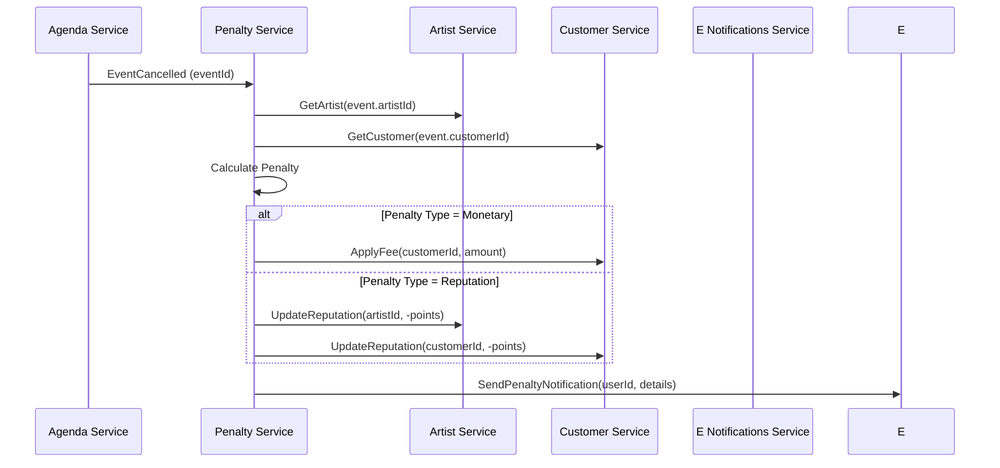

# Diseño de Sistema de Penalizaciones para Cancelaciones en Plataformas de Servicios  

Analizando las mejores prácticas de la industria y considerando tu arquitectura actual de bases de datos distribuidas, propongo el siguiente modelo escalable para implementar penalizaciones por cancelaciones:

---

## Modelo de Datos para Penalizaciones (MVP Escalable)  

### 1. Entidad `CancellationPenalty` (Base de Datos `inker-agenda`)  

```typescript
@Entity()
export class CancellationPenalty extends BaseEntity {
  @Index()
  @Column({ name: 'event_id' })
  eventId: string;

  @Column({ name: 'user_id' }) // Puede ser artistId o customerId
  userId: string;

  @Column({ type: 'enum', enum: PenaltyType })
  type: PenaltyType;

  @Column({ type: 'decimal', precision: 10, scale: 2 })
  amount: number;

  @Column({ type: 'jsonb', nullable: true })
  metadata: {
    cancellationTime: Date;
    originalEventStart: Date;
    userRole: 'artist' | 'customer';
    appliedAt: Date;
  };

  @Column({ default: PenaltyStatus.PENDING })
  status: PenaltyStatus;
}

export enum PenaltyType {
  FIXED_FEE = 'fixed_fee',
  PERCENTAGE = 'percentage',
  REPUTATION_POINTS = 'reputation_points'
}

export enum PenaltyStatus {
  PENDING = 'pending',
  APPLIED = 'applied',
  WAIVED = 'waived'
}
```

---

## Arquitectura de Servicios  

  

### 2. Patrón Anti-Corruption Layer (ACL)  

Para evitar acoplamiento entre bases de datos:  

```typescript
class PenaltyService {
  async calculatePenalty(eventId: string) {
    const event = await AgendaDB.getEvent(eventId);
    const user = await this.getUserFromService(event.userType, event.userId);
    
    return PenaltyEngine.calculate({
      event,
      user,
      businessRules: await RulesRepository.getActiveRules()
    });
  }

  private async getUserFromService(type: 'artist' | 'customer', id: string) {
    return type === 'artist' 
      ? ArtistServiceClient.getArtist(id)
      : CustomerServiceClient.getCustomer(id);
  }
}
```

---

## Reglas de Penalización (Basado en [2][17][11])  

### 3. Matriz de Penalizaciones  

| Factor                  | Artista                          | Cliente                          |
|-------------------------|----------------------------------|----------------------------------|
| Ventana Cancelación     | Sin restricción                  | 24-48h antes                     |
| Penalidad Monetaria     | 10-20% del valor cotización      | 5-15% o tarifa fija             |
| Impacto Reputación      | -2 pts por cancelación           | -1 pt por cancelación           |
| Límite Tolerancia       | 3 cancelaciones/mes              | 2 cancelaciones/mes              |
| Excepciones             | Emergencias médicas verificables | Casos de fuerza mayor documentados  

---

## Flujo de Trabajo Distribuido  



---

## Estrategia de Implementación  

### 4. Patrón Saga para Transacciones Distribuidas  

```typescript
class CancelEventSaga {
  async execute(eventId: string) {
    try {
      await SagaCoordinator.start();
      
      // Paso 1: Cancelar evento
      const event = await AgendaService.cancelEvent(eventId);
      
      // Paso 2: Calcular penalización
      const penalty = await PenaltyService.calculate(event);
      
      // Paso 3: Aplicar penalización
      await PenaltyApplier.apply(penalty);
      
      // Paso 4: Actualizar reputación
      await ReputationService.update(penalty);
      
      await SagaCoordinator.commit();
    } catch (error) {
      await SagaCoordinator.compensate();
      throw error;
    }
  }
}
```

---

## Optimización para Bases de Datos Separadas  

### 5. Técnica de Materialized Views  

```sql
-- En inker-agenda
CREATE MATERIALIZED VIEW cancellation_metrics AS
SELECT 
  user_id,
  COUNT(*) FILTER (WHERE user_role = 'artist') AS artist_cancellations,
  COUNT(*) FILTER (WHERE user_role = 'customer') AS customer_cancellations,
  SUM(amount) AS total_penalties
FROM cancellation_penalties
GROUP BY user_id;
```

---

## Recomendaciones de Escalabilidad  

1. **Event Sourcing**:  
   Registrar todos los cambios de estado como eventos inmutables para auditoría y recálculos.

2. **CQRS Pattern**:  
   Separar lecturas (consultas de penalizaciones) de escrituras (aplicación de reglas).

3. **API Composition**:  
   ```typescript
   class PenaltyAPI {
     async getFullPenaltyDetails(penaltyId) {
       const penalty = await PenaltyRepo.findById(penaltyId);
       const user = await UserService.get(penalty.userId);
       const event = await AgendaService.getEvent(penalty.eventId);
       return { ...penalty, user, event };
     }
   }
   ```

---

## Métricas Clave a Monitorear  

| Métrica                     | Objetivo          | Alerta                |
|-----------------------------|-------------------|-----------------------|
| Tasa de Cancelación         | < 15% mensual     | >20% por 3 días       |
| Penalizaciones Aplicadas    | 95% en <1h        | Tiempo promedio >2h   |
| Errores Cross-DB            | 0 eventos perdidos| >0.1% de errores      |

---

## Conclusión  

Este diseño permite:  

1. Mantener bases de datos separadas sin acoplamiento fuerte  
2. Escalar verticalmente el subsistema de penalizaciones  
3. Implementar reglas complejas sin impactar servicios core  
4. Agregar nuevos tipos de penalizaciones mediante configuración  

Para el MVP inicia con:  
- Penalización monetaria simple  
- Registro básico de reputación  
- Notificaciones por email  

Luego escala gradualmente añadiendo:  
- Sistema de créditos/descuentos  
- Machine Learning para ajuste dinámico de reglas  
- Integración con pasarelas de pago para cobro automático  
