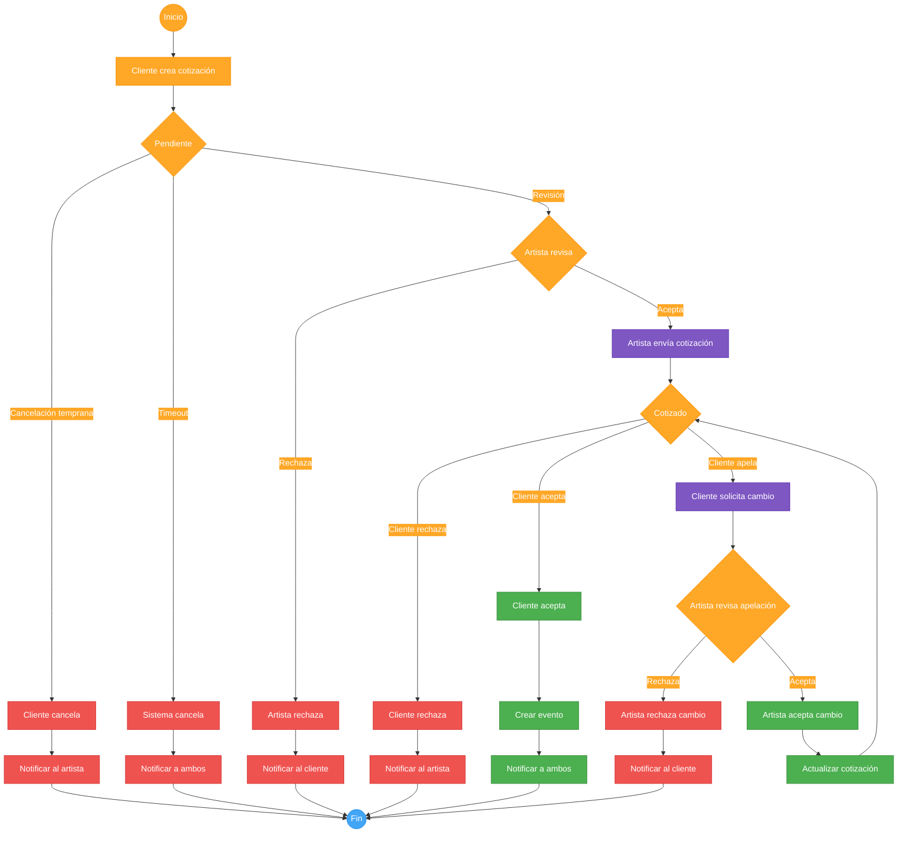

```mermaid
%%{
  init: {
    'theme': 'base',
    'themeVariables': {
      'primaryColor': '#42A5F5',
      'primaryTextColor': '#fff',
      'primaryBorderColor': '#1E88E5',
      'secondaryColor': '#FFA726',
      'tertiaryColor': '#7E57C2',
      'noteBkgColor': '#EF5350',
      'noteTextColor': '#fff',
      'noteBorderColor': '#D32F2F',
      'lineColor': '#333',
      'textColor': '#333'
    }
  }
}%%

flowchart TD
    Start((Inicio)) --> CreateQuotation[Cliente crea cotización]
    CreateQuotation --> Pending{Pendiente}
    
    Pending -->|Cancelación temprana| CancelEarly[Cliente cancela]
    CancelEarly --> NotifyArtistEarly[Notificar al artista]
    NotifyArtistEarly --> End((Fin))
    
    Pending -->|Timeout| SystemCancel[Sistema cancela]
    SystemCancel --> NotifyBothTimeout[Notificar a ambos]
    NotifyBothTimeout --> End
    
    Pending -->|Revisión| ArtistReview{Artista revisa}
    
    ArtistReview -->|Rechaza| ArtistRejects[Artista rechaza]
    ArtistRejects --> NotifyClientRejection[Notificar al cliente]
    NotifyClientRejection --> End
    
    ArtistReview -->|Acepta| ArtistQuotes[Artista envía cotización]
    ArtistQuotes --> Quoted{Cotizado}
    
    Quoted -->|Cliente rechaza| ClientRejects[Cliente rechaza]
    ClientRejects --> NotifyArtistRejection[Notificar al artista]
    NotifyArtistRejection --> End
    
    Quoted -->|Cliente acepta| ClientAccepts[Cliente acepta]
    ClientAccepts --> CreateEvent[Crear evento]
    CreateEvent --> NotifyBothAccepted[Notificar a ambos]
    NotifyBothAccepted --> End
    
    Quoted -->|Cliente apela| ClientAppeals[Cliente solicita cambio]
    ClientAppeals --> ArtistReviewAppeal{Artista revisa apelación}
    
    ArtistReviewAppeal -->|Rechaza| ArtistRejectsAppeal[Artista rechaza cambio]
    ArtistRejectsAppeal --> NotifyClientAppealRejected[Notificar al cliente]
    NotifyClientAppealRejected --> End
    
    ArtistReviewAppeal -->|Acepta| ArtistAcceptsAppeal[Artista acepta cambio]
    ArtistAcceptsAppeal --> UpdateQuotation[Actualizar cotización]
    UpdateQuotation --> Quoted

    classDef default fill:#42A5F5,stroke:#1E88E5,color:#fff;
    classDef decision fill:#FFA726,stroke:#FB8C00,color:#fff;
    classDef positive fill:#4CAF50,stroke:#388E3C,color:#fff;
    classDef negative fill:#EF5350,stroke:#D32F2F,color:#fff;
    classDef neutral fill:#7E57C2,stroke:#5E35B1,color:#fff;

    class Start,CreateQuotation,Pending,ArtistReview,Quoted,ArtistReviewAppeal decision;
    class ClientAccepts,ArtistAcceptsAppeal,CreateEvent,UpdateQuotation,NotifyBothAccepted positive;
    class CancelEarly,SystemCancel,ArtistRejects,ClientRejects,ArtistRejectsAppeal,NotifyArtistEarly,NotifyBothTimeout,NotifyClientRejection,NotifyArtistRejection,NotifyClientAppealRejected negative;
    class ArtistQuotes,ClientAppeals neutral;
```